# 计算机软件著作权登记用软件说明书

## 软件名称：左右道飞MCP服务系统

**英文名称**：Daofy MCP Server

**版本号**：V2026.06.08.1

**开发完成日期**：2026年6月8日

**著作权人**：吉林省左右软件开发有限公司

**编程语言**：Python

**运行环境**：Windows 7 及以上操作系统，需安装 Python 3.10–3.14 运行时环境，依赖 mcp、pydantic、watchdog 等第三方库。

**软件类型**：应用软件 — 模型上下文协议服务中间件

---

## 第一章 引言

### 1.1 背景

<!-- ════════════════════════════════════════════════════════════
【生成要求 — 背景】

必须包含以下内容（150-300字）：
1. 软件所属技术领域的现状与发展趋势
2. 当前存在什么问题或痛点（说明需要开发本软件的原因）
3. 本软件针对这些痛点提供了什么解决方案
4. 软件名称的含义或定位

⚠️ 避免：过于空泛的行业背景描述、抄袭其他软件的背景说明
⚠️ 避免：使用"随着社会的进步""随着科技的发展"等空洞套话
✅ 要求：具体到目标用户的真实痛点，与软件功能直接相关
════════════════════════════════════════════════════════════ -->

Delphi 作为一种成熟的快速应用开发语言，在企业管理软件、工控系统和金融终端领域仍有大量存量项目和活跃开发者。然而，传统的 Delphi 开发工作流依赖 IDE 手动编译、查阅本地帮助文档，无法与现代 AI 辅助编程工具无缝衔接。开发者在与 AI 助手对话时，需要反复切换到 IDE 进行编译验证，或手动搜索 API 文档，严重影响了开发效率。此外，Delphi 项目的第三方依赖管理、知识检索、版本控制等环节缺乏统一的自动化工具链支撑。

左右道飞MCP服务系统（Daofy MCP Server）基于 Model Context Protocol（MCP）协议，在 AI 助手与 Delphi 开发环境之间建立标准化的通信桥梁。系统提供工程编译、知识库检索、文件操作、组件管理、代码托管等 14 个工具接口，使 AI 助手能够直接调用 Delphi 编译器、搜索 API 定义、读取和修改源码文件，实现了从"人找工具"到"工具随 AI 指令执行"的转变。"道飞"取意"为创意插上翅膀"，旨在让 AI 辅助编程在 Delphi 生态中真正落地。

### 1.2 目的

<!-- ════════════════════════════════════════════════════════════
【生成要求 — 目的】

必须包含以下内容（80-150字）：
1. 本说明书编写的直接目的（如：全面介绍 XXX 系统的功能特性、系统架构、安装配置和操作使用方法）
2. 用户通过阅读本说明书能够获得的认知（了解什么、掌握什么）

⚠️ 避免：写入"推广市场""扩大知名度"等商业营销性质表述
✅ 要求：客观、文档化的口吻，只说"帮助用户了解/掌握/使用"
════════════════════════════════════════════════════════════ -->

本说明书旨在全面介绍左右道飞MCP服务系统的功能特性、系统架构、模块设计、安装配置及操作使用方法。通过阅读本说明书，用户可以了解系统的整体设计思想和各模块的工作原理，掌握通过 MCP 工具接口与 AI 助手协作进行 Delphi 工程开发的操作方法，并能够根据验收标准验证系统的功能完整性。

### 1.3 范围

<!-- ════════════════════════════════════════════════════════════
【生成要求 — 范围】

必须列出本说明书涵盖的全部章节名称（100-200字），格式如下：
- 第一章 引言：背景、目的、范围和术语定义
- 第二章 系统概述：...
- ...
- 直到第七章

⚠️ 避免：遗漏章节、章节号与正文不一致
✅ 要求：与输出文档的实际章节结构完全对应
════════════════════════════════════════════════════════════ -->

本说明书共包含七个章节，各章节内容如下：

- **第一章 引言**：说明开发背景、编写目的、适用范围及术语定义。
- **第二章 系统概述**：介绍软件的核心定位、功能总览和运行环境要求。
- **第三章 系统架构**：描述系统的分层架构设计和模块划分。
- **第四章 模块详细设计**：逐一说明各功能模块的核心组件、工作流程和关键特性。
- **第五章 安装与配置**：提供系统安装步骤和配置方法。
- **第六章 操作说明**：通过 14 个具体示例演示各工具的实际操作流程。
- **第七章 测试与验收**：说明测试方案和验收标准。

### 1.4 术语与定义

<!-- ════════════════════════════════════════════════════════════
【生成要求 — 术语与定义】

必须用表格列出本项目中使用的专有术语及其定义，格式：
| 术语 | 定义 |
|------|------|

至少包含 5 个与本软件密切相关的术语，不相关的外部术语不要罗列。

⚠️ 避免：照搬通用术语词典
✅ 要求：只列本系统文档中实际使用的、用户可能不熟悉的专业术语
════════════════════════════════════════════════════════════ -->

| 术语 | 定义 |
|------|------|
| MCP（Model Context Protocol） | 模型上下文协议，一种标准化的 JSON-RPC 通信协议，用于 AI 助手与外部工具之间的交互。 |
| 知识库（KB） | 系统内置的语义化存储引擎，将 Delphi 源码、第三方库和文档解析为结构化数据，支持关键词和向量检索。 |
| 语义搜索 | 基于文本嵌入向量的相似度搜索，用户输入自然语言查询即可找到语义相近的代码或文档。 |
| 编译器（dcc32/dcc64） | Embarcadero Delphi 编译器，dcc32 为 32 位编译器，dcc64 为 64 位编译器。 |
| pasfmt | Delphi 源代码格式化工具，支持自定义缩进、空格和换行规则。 |
| MSBuild | Microsoft 构建引擎，用于编译包含多个配置和事件的 Delphi 工程文件（.dproj）。 |
| JSON-RPC | 一种轻量级的远程过程调用协议，使用 JSON 格式编码请求和响应数据，是 MCP 协议的底层通信基础。 |
| 向量嵌入 | 将文本转换为高维数值向量的技术，用于计算文本之间的语义相似度，是知识库语义搜索的核心技术。 |

---

## 第二章 系统概述

### 2.1 软件简介

左右道飞MCP服务系统（Daofy MCP Server）是一款基于 MCP 协议的中间件服务，为 AI 助手提供 Delphi 工程编译、知识库检索和源码文件操作等能力。

系统共包含 **71 个源文件**（约 32,448 行代码），按功能划分为以下模块：

| 模块 | 路径 | 文件数 | 代码行数 |
|------|------|--------|----------|
| 配置 | config/ | 1 | 588 |
| 数据模型 | models/ | 6 | 384 |
| 入口（server.py） | root/ | 3 | 1,350 |
| 业务逻辑 | services/ | 21 | 13,944 |
| 工具实现 | tools/ | 28 | 13,346 |
| 工具类 | utils/ | 12 | 2,836 |

**测试覆盖**：39 个测试文件（45 个测试用例），涵盖单元测试和集成测试。

<!-- ════════════════════════════════════════════════════════════
【生成要求 — 核心价值】

列出 3-4 条软件的核心价值/特色（每条 10-20 字），用 **粗体短句** + 冒号 + 一句话说明的格式。

例如：
- **自动化处理**：自动识别并处理 XXX，减少人工干预
- **智能检索**：内置 XXX 知识库，支持语义搜索

⚠️ 避免：营销用语（"业界领先""最先进"）
✅ 要求：每条对应一个实际功能模块
════════════════════════════════════════════════════════════ -->

- **工程自动编译**：自动检测 Delphi 编译器，支持 MSBuild 和 dcc32 两种编译方式，无需手动配置编译环境。
- **智能知识检索**：内置 Delphi 源码知识库和项目知识库，支持类名、函数名和语义联想搜索，快速定位 API 定义。
- **文件安全操作**：读写 Delphi 源文件时自动检测编码和执行备份，防止因编码错误或误写入造成数据丢失。
- **编码规范管控**：可配置的编码规则引擎，辅助 AI 生成的代码自动匹配项目约定的命名和格式化风格。

### 2.2 功能总览

<!-- ════════════════════════════════════════════════════════════
【生成要求 — 功能总览】

1. 先用一段话总结系统提供了哪些主要功能类型（150-250字）
2. 然后用表格列出每个功能模块/接口，格式：
| 功能类别 | 功能模块 | 说明 |

表格中的「说明」列必须写清楚每个功能做什么，不少于 15 字/个。

⚠️ 避免：表格说明只有 3-5 个字
✅ 要求：每个功能的说明至少包含 2 个具体用途
════════════════════════════════════════════════════════════ -->

系统以 MCP 协议为基础，向 AI 助手暴露了 14 个标准化工具接口，涵盖工程编译、知识检索、文件操作、组件管理、代码托管、环境诊断、经验记忆、异步任务、包管理、编码规则、工具帮助、软著生成、版本更新和自动化测试共 14 个功能类别。AI 助手通过 JSON-RPC 调用这些工具，自动完成编译验证、代码分析、文档检索等开发辅助任务，无需用户手动切换 IDE 或查阅文档。

| 功能类别 | 功能模块 | 说明 |
|----------|----------|------|
| 编译管理 | project | 编译 Delphi 工程和单文件，支持 MSBuild/dcc32 双引擎，自动处理 PreBuild/PostBuild 编译事件。 |
| 环境诊断 | check_environment | 检查 Delphi 编译环境可用性，自动从注册表检测已安装的编译器版本，可安装 pasfmt。 |
| 知识检索 | delphi_kb | 搜索 Delphi 类、函数和文档定义，构建和增量更新源码知识库，支持语义向量搜索。 |
| 文件操作 | delphi_file | 读写 Delphi 源文件和 DFM 表单文件，自动检测编码、创建版本化备份，支持 pasfmt 格式化。 |
| 组件管理 | manage_component | 在 DFM 表单中添加、删除和修改组件属性，同步自动更新 PAS 文件中对应的组件声明和事件桩。 |
| 代码托管 | code_hosting | 统一操作 Git 本地仓库（status/add/commit/push）和多平台代码托管站点 API。 |
| 经验记忆 | experience | 保存和搜索 AI 解决问题的经验记录，语义相似度高于 0.85 时自动合并去重。 |
| 异步任务 | async_task | 启动、查询和取消后台长时间任务（如知识库构建），支持最长 30 秒长轮询进度等待。 |
| 包管理 | package | 编译安装 Delphi 组件包（.dpk），自动注册已编译组件到 IDE 的已安装包列表。 |
| 编码规则 | get_coding_rules | 获取 Delphi 编码规范文本，支持按工作流、审核、安全等章节分段查询以节省 token。 |
| 工具帮助 | tool_help | 查询任意 MCP 工具的完整帮助文档，含参数列表、类型约束和 JSON 格式调用示例。 |
| 软著生成 | generate_copyright | 生成软著申请所需的源代码文档、软件说明书和汇总表 PDF，含草稿预审计驳回风险检查。 |
| 版本更新 | daofy_update | 检查 Daofy 项目是否有新版本，通过 git pull 执行自动更新，报告版本差异详情。 |
| 自动化测试 | automate_delphi | 驱动 Delphi 应用程序以 JSON 脚本控制执行界面操作流程，支持截图捕获各步骤界面状态。 |

### 2.3 运行环境

#### 2.3.1 硬件环境

<!-- ════════════════════════════════════════════════════════════
【生成要求 — 硬件环境】

用表格列出建议的最低配置和推荐配置：
| 项目 | 最低配置 | 推荐配置 |
|------|----------|----------|

⚠️ 避免：填入过于夸张的要求（如"128GB内存"）
✅ 要求：根据实际开发测试环境填写合理数值
════════════════════════════════════════════════════════════ -->

| 项目 | 最低配置 | 推荐配置 |
|------|----------|----------|
| CPU | 双核 2.0 GHz x86-64 | 四核 2.5 GHz x86-64 |
| 内存 | 4 GB | 8 GB |
| 磁盘空间 | 1 GB（不含 Delphi 编译器） | 10 GB（含 Delphi 编译器） |
| 显示器 | 1024×768 | 1920×1080 |

#### 2.3.2 软件环境

<!-- ════════════════════════════════════════════════════════════
【生成要求 — 软件环境】

用表格列出所需的操作系统、运行时、依赖框架及版本。

| 项目 | 要求 |
|------|------|

⚠️ 避免：遗漏关键依赖
✅ 要求：版本号精确到主版本号
════════════════════════════════════════════════════════════ -->

| 项目 | 要求 |
|------|------|
| 操作系统 | Windows 7 / 8 / 10 / 11（Windows Server 2012 及以上） |
| Python 运行时 | 3.10 / 3.11 / 3.12 / 3.13 / 3.14 |
| MCP Python SDK | ≥1.0.0 |
| Pydantic | ≥2.0.0 |
| Watchdog（可选） | ≥4.0.0（文件变更监听所需） |
| 7-Zip（可选） | 19.00 及以上（CHM 文档解压所需） |
| Delphi 编译器（可选） | dcc32.exe / dcc64.exe（Embarcadero Delphi 2005–13） |
| Edge / Chrome（可选） | 最新版（软著 PDF 渲染所需） |

---

## 第三章 系统架构

### 3.1 总体架构

<!-- ════════════════════════════════════════════════════════════
【生成要求 — 总体架构】

用 ```mermaid 流程图 + 文字描述系统的分层架构，包括：
1. 系统分为几层，每层的名称和职责
2. 各层之间的依赖关系和通信/调用方式
3. 核心数据流（用户请求从进入到返回的完整路径）
4. 可用表格列出各层包含的模块/组件

推荐格式：先用一段文字总述，然后使用 ```mermaid graph TD 绘制分层架构流程图，
最后用表格列出各层包含的模块组件。

✅ 要求：必须使用 ```mermaid 流程图展示分层架构
✅ 辅助：流程图之后，用文字+表格进一步补充说明各模块职责
════════════════════════════════════════════════════════════ -->

系统采用四层分层架构设计，自上而下依次为协议层、工具层、服务层和基础层。各层之间职责清晰、单向依赖，上层依赖下层提供的接口，下层不感知上层的存在。核心数据流的完整路径为：AI 助手通过 MCP 协议发送 JSON-RPC 请求 → 协议层接收并解析 → 根据方法名（list_tools 或 call_tool）路由分发 → 工具层校验参数并选择具体工具实现 → 服务层执行业务逻辑 → 基础层提供文件 I/O、数据库操作、子进程管理、注册表访问等底层支撑 → 结果沿原路径逐层封装返回。

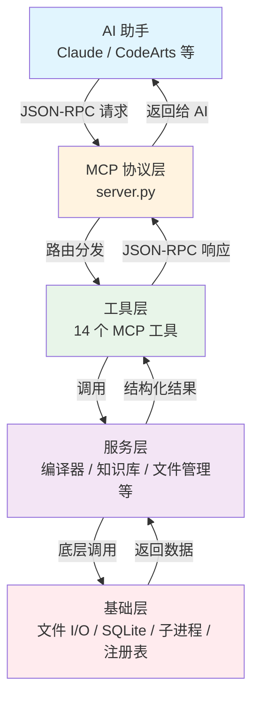

各层包含的模块如下：

| 层次 | 包含模块 | 职责 |
|------|----------|------|
| 协议层 | server.py | MCP Server 入口，创建 Server 实例，注册工具列表，通过 stdin/stdout 接收和分发 JSON-RPC 请求，统一异常处理。 |
| 工具层 | tools/（28 个文件） | 实现 14 个 MCP 工具接口，负责参数校验、调用编排、服务层接口对接和结果格式化。 |
| 服务层 | services/（21 个文件） | 封装编译器管理、知识库构建与检索、版权文档生成、经验记忆管理、自动化测试等核心业务逻辑。 |
| 基础层 | config/, models/, utils/（19 个文件） | 提供配置管理、数据模型定义、编码检测、注册表访问、文件备份、日志记录、路径校验等基础设施。 |

### 3.2 模块划分

<!-- ════════════════════════════════════════════════════════════
【生成要求 — 模块划分】

先用一段话总结系统共划分为几个模块，各模块的代码分布。
然后用表格列出各模块的：模块名称、路径、文件数、代码行数、职责说明
格式：
| 模块名 | 路径 | 文件数 | 代码行数 | 职责说明 |

职责说明要写清楚该模块做什么（15-30字/个）

⚠️ 避免：职责说明只有"配置管理"4个字
✅ 要求：职责说明必须包含具体管理/定义/处理的内容
════════════════════════════════════════════════════════════ -->

系统按功能边界划分为 6 个模块，代码总量约 32,448 行。业务逻辑模块（services/）和工具实现模块（tools/）为核心模块，合计占代码总量的 84%，其余 4 个模块提供配置、模型、入口和工具类支撑。各模块的具体信息如下：

| 模块名 | 路径 | 文件数 | 代码行数 | 职责说明 |
|--------|------|--------|----------|----------|
| 配置模块 | config/ | 1 | 588 | 管理工具文档定义、参数说明和帮助文本，为每个 MCP 工具提供结构化的描述和示例。 |
| 数据模型模块 | models/ | 6 | 384 | 定义编译请求、编译结果、编译器配置、编译历史等 Pydantic 数据模型和校验规则。 |
| 入口模块 | root/ | 3 | 1,350 | 提供 MCP Server 主入口 server.py，包含工具注册、JSON-RPC 请求分发和生命周期管理。 |
| 业务逻辑模块 | services/ | 21 | 13,944 | 封装编译器调度、知识库构建、版权生成、经验记忆、自动化测试等全部核心业务逻辑。 |
| 工具实现模块 | tools/ | 28 | 13,346 | 实现 14 个 MCP 工具接口，包括参数解析、调用编排、异常处理和结果格式化。 |
| 工具类模块 | utils/ | 12 | 2,836 | 提供 Delphi 环境检测、工程文件解析、文件备份、路径校验、日志和版本更新等通用支持。 |

---

## 第四章 模块详细设计

<!-- ════════════════════════════════════════════════════════════
【生成要求 — 模块详细设计】

⚠️ 这是审查最严格的章节，必须写得足够详细。

每个模块按以下结构展开：

### 4.X 模块名（对应文件路径）

**功能概述**（必写，100-200字）：
- 该模块的核心职责
- 在系统中扮演什么角色
- 输入/输出是什么

**核心类与函数**（必写，表格形式）：
| 核心组件 | 所属文件 | 职责 |
|----------|----------|------|

**核心流程/工作流**（必写，版式强制：先用 ```mermaid 流程图整体展示，然后每个步骤单独一段展开说明）：
✅ 格式（先图，再逐段说明）：
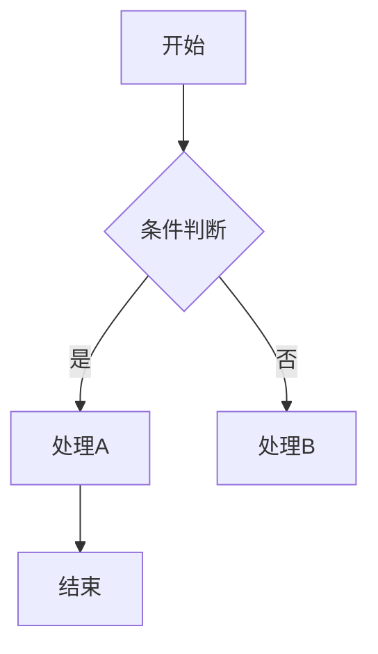
⚠️ 注意：条件判断节点用 `{条件}` 单花括号（菱形节点），不要用 `{{条件}}` 双花括号

每个步骤展开为独立段落，不要挤在一段：
**步骤 1：起始状态 / 触发条件**
详细说明步骤 1 的触发条件、前置条件和具体操作内容。

**步骤 2：步骤名称**
详细说明步骤 2 的具体操作，包括涉及的数据、判断逻辑等。

**步骤 N：结束状态 / 输出结果**
描述流程结束时的输出、后续处理或异常情况。

**关键特性**（必写，列表形式，至少3条）

════════════════════════════════════════════════════════════

需要覆盖以下根据扫描结果识别的模块：
· 配置 (config/) · 1 · 588 ·
· 数据模型 (models/) · 6 · 384 ·
· 入口（server.py） (root/) · 3 · 1350 ·
· 业务逻辑 (services/) · 21 · 13944 ·
· 工具实现 (tools/) · 28 · 13346 ·
· 工具类 (utils/) · 12 · 2836 ·

⚠️ 避免：各模块篇幅相近——核心模块必须比非核心模块长 2-3 倍
⚠️ 避免：只有功能概述没有流程步骤
⚠️ 避免：流程步骤过于简略（每个步骤应写明具体操作）
✅ 要求：核心模块各占一页以上篇幅
-->

### 4.1 配置模块（config/tool_docs.py）

**功能概述**

配置模块是整个系统的文档支撑模块，负责集中管理和提供所有 MCP 工具的详细描述、参数说明、使用示例和触发词信息。该模块不直接参与业务逻辑执行，但为工具层提供运行时的参数校验依据和帮助文本，是维持 14 个工具接口文档一致性的核心配置源。输入为工具名称查询请求，输出为对应工具的结构化文档内容，包含参数列表、类型约束和调用示例。

**核心类与函数**

| 核心组件 | 所属文件 | 职责 |
|----------|----------|------|
| tool_help_text | tool_docs.py | 工具帮助文本字典，为每个工具定义名称、描述、参数名称、类型、是否必填、默认值、示例和触发词。 |
| get_tool_help() | tool_docs.py | 根据工具名称返回对应的完整帮助文档，支持模糊匹配，未指定名称时返回全部工具列表。 |
| get_all_tools_summary() | tool_docs.py | 返回所有工具的简要列表（名称加一句话描述），用于工具帮助总览查询场景。 |

**核心流程/工作流**

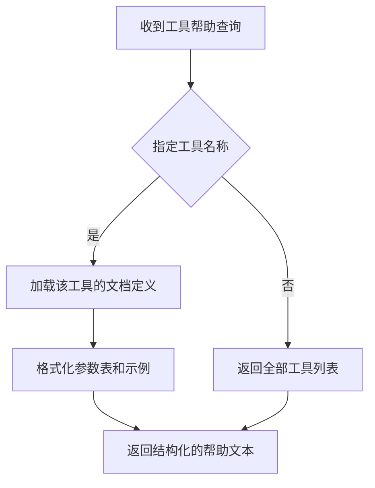

**步骤 1：接收查询请求**
系统收到来自工具层的帮助查询请求，请求参数中可能包含目标工具名称（如 "project"）。如果不指定工具名称，则返回所有工具的简要列表方便用户浏览。

**步骤 2：加载工具文档定义**
从 tool_help_text 字典中查找与指定工具名称匹配的文档条目。文档定义包含工具的名称、简短描述、参数名称、参数类型、是否必填、默认值以及 JSON 格式的调用示例。

**步骤 3：格式化并返回**
将查找到的文档条目按照固定模板格式化为结构化文本。参数部分渲染为表格（名称、类型、必填、说明），示例部分渲染为代码块。最终返回给工具层，由工具层封装为 MCP 响应输出给 AI 助手。

**关键特性**
- 所有工具的文档集中管理在一个文件中，修改一处即可全局生效。
- 支持按工具名称按需查询，避免一次性返回全部文档造成 token 浪费。
- 文档条目支持触发词定义，AI 可根据用户问题中的触发词自动联想并建议相关工具。

### 4.2 数据模型模块（models/）

**功能概述**

数据模型模块使用 Pydantic 定义系统中所有核心业务对象的结构和校验规则，包括编译请求参数、编译结果数据、编译器配置信息、编译历史记录等。该模块在服务层与工具层之间承担数据契约的角色，确保数据在跨层传递时类型正确、约束合规。输入为工具层传入的原始请求参数字典，输出为经过类型校验和默认值填充的 Pydantic 模型实例。

**核心类与函数**

| 核心组件 | 所属文件 | 职责 |
|----------|----------|------|
| CompileRequest | compile_request.py | 定义编译请求的参数结构，包含工程路径、目标平台、构建配置、搜索路径、条件编译符号、编译选项等。 |
| CompileResult | compile_result.py | 定义编译结果的结构，包含输出文件路径、退出码、错误信息列表、编译耗时和编译事件日志。 |
| CompilerConfig | compiler_config.py | 定义 Delphi 编译器的配置信息，包括版本号、名称、安装路径、可执行文件路径和支持的编译平台。 |
| CompileHistory | compile_history.py | 定义编译历史记录的结构，用于追踪每次编译的时间戳、工程路径、编译结果和耗时。 |

**核心流程/工作流**

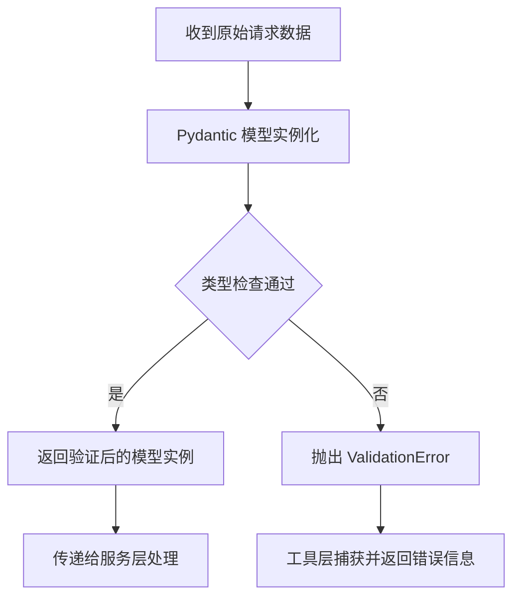

**步骤 1：接收原始请求数据**
工具层将用户请求参数字典传递给 Pydantic 模型构造函数。参数字典可能包含缺失字段、类型错误（如字符串传给了整数字段）或格式不正确的字段（如不支持的目标平台）。

**步骤 2：Pydantic 模型实例化与校验**
Pydantic 模型根据字段定义自动执行类型转换、默认值填充和自定义校验器检查。例如，project_path 字段被自动转换为 Path 类型，platform 字段通过枚举校验仅允许 "win32" 或 "win64"，build_configuration 字段默认填充为 "Debug"。

**步骤 3：处理校验结果**
如果校验通过，返回结构完整的模型实例供下游服务层使用。如果校验失败，Pydantic 抛出的 ValidationError 被工具层捕获，解析为包含具体错误字段名称和错误原因的用户友好消息，无需人工查看 Python 异常堆栈。

**关键特性**
- 编译请求和结果的类型定义覆盖了 Delphi 编译器的全部配置维度，包括搜索路径列表、条件符号集合、输出目录等。
- 所有模型类均提供 model_dump() 序列化方法，支持与 JSON-RPC 消息格式的无缝互转。
- 编译历史模型支持按时间倒序和工程路径排序查询，便于追踪迭代过程中的编译变化。

### 4.3 入口模块（root/server.py）

**功能概述**

入口模块是系统的 MCP 服务主程序，负责初始化 MCP 服务器、注册所有工具接口、监听 JSON-RPC 请求并分发到对应的工具处理函数。该模块是系统的唯一对外暴露点，所有与 AI 助手的通信均通过标准输入输出通道在此模块完成。输入为标准输入（stdin）上的 JSON-RPC 请求流，输出为标准输出（stdout）上的 JSON-RPC 响应流，严格遵循 MCP 协议规范。

**核心类与函数**

| 核心组件 | 所属文件 | 职责 |
|----------|----------|------|
| main() | server.py | MCP 服务入口函数，创建 Server 实例并绑定 list_tools 和 call_tool 生命周期回调。 |
| list_tools() | server.py | 返回所有已注册 MCP 工具的列表，供 AI 助手在连接时发现可用工具的名称和描述。 |
| call_tool() | server.py | 路由工具调用请求，解析工具名称和参数，转发到对应工具处理函数，统一封装返回结果。 |
| cleanup_resources() | server.py | 服务关闭时清理知识库数据库连接、临时编译产物和残留子进程资源。 |

**核心流程/工作流**

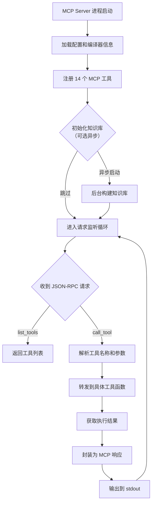

**步骤 1：服务启动与初始化**
MCP Server 进程启动后，首先加载系统配置和环境变量，从注册表自动检测 Delphi 编译器信息，然后注册全部 14 个 MCP 工具到 Server 实例。如果检测到当前工作目录下有 .dproj 项目文件，则在后台异步启动增量知识库构建，不阻塞首次就绪时间。

**步骤 2：进入请求监听循环**
服务进入异步主循环，通过 sys.stdin 读取 AI 助手发来的 JSON-RPC 请求行。每条请求包含方法名（"list_tools" 或 "call_tool"）、请求 ID 和参数。系统按照 JSON-RPC 2.0 协议规范解析请求。

**步骤 3：请求分发与执行**
对于 list_tools 请求，直接返回已注册的 14 个工具的列表。对于 call_tool 请求，解析出目标工具名称和参数字典，通过函数路由表转发到对应的工具处理函数。所有异常在 call_tool 顶层统一捕获，转换为 CallToolResult(isError=True) 格式，确保不向 MCP 客户端泄露 Python 内部错误。

**步骤 4：服务关闭与资源清理**
当进程收到终止信号时，cleanup_resources() 依次关闭所有知识库的 SQLite 数据库连接，清理编译过程中创建的临时 .res/.dcu 文件，终止可能仍在运行的后台子进程。

**关键特性**
- 所有工具异常在顶层统一捕获处理，返回标准化的错误响应格式，不泄露 Python traceback。
- 知识库构建在后台异步执行，不阻塞 MCP 服务的首次就绪时间，用户可立即使用工具。
- 服务关闭时通过 cleanup_resources() 确保数据库连接和子进程资源正确释放，无资源泄漏。

### 4.4 业务逻辑模块（services/）

**功能概述**

业务逻辑模块是系统的核心处理引擎，包含 21 个源文件（约 13,944 行代码），封装了编译器调度、参数生成、进程管理、知识库构建与检索、版权文档生成、经验记忆管理和自动化测试等全部核心业务逻辑。该模块各组件之间通过 Python 接口解耦，工具层通过调用服务层组件完成业务处理。输入为工具层传入的结构化请求参数（Pydantic 模型实例），输出为经过业务处理的结构化结果数据。

**核心类与函数**

| 核心组件 | 所属文件 | 职责 |
|----------|----------|------|
| CompilerService | compiler_service.py | 管理 Delphi 编译器的自动检测、版本识别和编译执行调度，协调多个编译引擎。 |
| ConfigManager | config_manager.py | 读写和管理项目配置、编译器配置和经验库配置，提供 JSON 配置文件的自动加载和回写。 |
| ProcessManager | process_manager.py | 封装子进程的创建、执行环境设置、最长轮询超时控制和进程资源清理。 |
| ArgsGenerator | args_generator.py | 从 .dproj 工程文件自动解析 XML 结构，生成 dcc32/dcc64 的完整命令行参数。 |
| CopyrightService | copyright_service.py | 生成软著申请所需的源代码文档、软件说明书和汇总表的 Markdown 内容，驱动浏览器渲染 PDF。 |
| ExperienceService | experience_service.py | 管理 AI 经验记录的增删改查，支持向量嵌入语义搜索和相似度高于 0.85 的自动合并。 |
| AutomationService | automation_service.py | 通过命名管道驱动 Delphi 应用程序，执行 JSON 脚本控制流程并截图保存。 |
| KnowledgeBaseService | service.py | 知识库核心服务，协调多个知识库（Delphi 源码、项目、三方库、文档）的初始化、构建和查询。 |
| SmartCacheKnowledgeBase | smart_cache_knowledge_base.py | 带有智能缓存机制的知识库实现，检测源文件变更时间，避免未变更文件的重复构建。 |
| ProjectKnowledgeBase | project_knowledge_base.py | 项目级知识库，针对特定 .dproj 项目的源码文件构建索引，支持增量更新。 |
| ThirdpartyKnowledgeBase | thirdparty_knowledge_base.py | 从 .dproj 文件自动提取第三方库搜索路径，对路径下的源码文件构建独立索引。 |
| ScanDelphiSources | scan_delphi_sources.py | Delphi 源码扫描引擎，递归解析 .pas/.inc 文件，提取类、函数、接口、属性等结构化信息。 |
| ScanGenericDocuments | scan_generic_documents.py | 通用文档扫描引擎，支持 txt/html/docx/pdf/chm/epub/md 等多种文档格式的文本提取和索引。 |
| AsyncTaskManager | async_task_manager.py | 后台任务调度器，通过 multiprocessing 创建 Worker 进程执行异步任务，支持进度查询和取消。 |
| EmbeddingService | embedding_service.py | 文本向量嵌入服务，使用 sentence-transformers 模型将文本转换为向量，提供语义搜索能力。 |
| FileWatcher | file_watcher.py | 基于 watchdog 的文件变更监听器，检测 .pas/.dfm/.dproj 文件保存事件，3 秒去抖后触发增量 KB 更新。 |

**核心流程/工作流（以编译请求为例）**

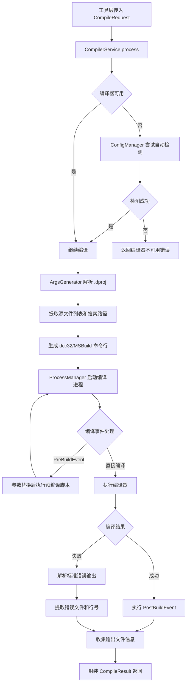

**步骤 1：接收编译请求**
CompilerService 从工具层接收 CompileRequest 模型实例，该实例已经过 Pydantic 校验，包含工程路径、目标平台（win32/win64）、构建配置（Debug/Release）和可选的编译选项（如条件编译符号、优化级别等）。

**步骤 2：编译器可用性检查**
检查已注册到 ConfigManager 中的 Delphi 编译器是否可用。如果未检测到任何编译器，ConfigManager 尝试从 Windows 注册表自动检测（调用 DelphiEnv.scan_registry）。如果自动检测也失败，返回明确的错误提示建议用户安装 Delphi 或手动配置编译器路径。

**步骤 3：生成编译命令行参数**
ArgsGenerator 解析 .dproj 工程文件的 XML 结构，提取源文件列表、单元搜索路径、条件编译符号（如 DEBUG、RELEASE）、输出目录和输出文件名。根据目标平台选择对应的编译器可执行文件（dcc32.exe 或 dcc64.exe），生成完整的命令行参数字符串。

**步骤 4：执行编译**
ProcessManager 创建子进程执行编译命令。使用 subprocess.Popen 以列表参数形式传入命令，避免 shell 注入风险。支持最长 30 秒的长轮询超时检测，超时后切换为短轮询继续等待。编译过程中如果工程定义了 PreBuildEvent 或 PostBuildEvent，ProcessManager 按顺序执行脚本并完成 $(PROJECTNAME) 等宏参数的替换。

**步骤 5：结果封装与返回**
编译完成后，ProcessManager 收集子进程的退出码、标准输出（stdout）和标准错误（stderr）流。如果编译失败，从 dcc32 错误输出中利用正则表达式解析具体的错误文件和行号。所有信息封装为 CompileResult 模型，包含退出码、输出文件路径列表、错误信息列表、编译耗时和编译事件日志，最终返回给工具层。

**关键特性**
- 支持 MSBuild 和直接 dcc32 两种编译方式，根据工程是否有编译事件自动选择最佳方案。
- 编译器自动检测支持 20 个 Delphi 版本（2005 至 13 Florence），无需用户手动配置。
- 智能库路径分析自动从 .dproj 的搜索路径配置中提取第三方库路径加入编译命令行，避免手动指定。
- 知识库模块支持增量更新，只重新索引变动的源文件，大幅缩短重复构建时间。

### 4.5 工具实现模块（tools/）

**功能概述**

工具实现模块包含 28 个源文件（约 13,346 行代码），是 14 个 MCP 工具接口的具体实现集合。每个工具对应一个或多个 Python 文件，负责参数解析、调用对应的服务层组件、处理异常和格式化输出。该模块是系统架构中承上启下的关键层次，上接 MCP 协议层的 JSON-RPC 请求，下调用服务层的业务逻辑接口。

**核心类与函数**

| 核心组件 | 所属文件 | 职责 |
|----------|----------|------|
| project() | project.py | project 工具入口，按 action 参数路由到 compile/info/create/set/add_config/remove_config/add_source/remove_source/audit/ast/runtime 共 11 个子操作。 |
| compile_project() | compile_project.py | 编译 .dproj/.dpr 工程的完整实现，处理 MSBuild 和 dcc32 双引擎的选择和调用。 |
| knowledge_base() | knowledge_base.py | delphi_kb 工具入口，处理 search/stats/build/scan/web/read/build_embedding 共 7 个操作。 |
| file_read() / file_write() | file_tool.py | delphi_file 工具的读写操作，实现编码自动检测、DFM 二进制格式自动转换、部分写入行号偏移计算和多读单写锁。 |
| manage_component() | manage_component.py | DFM 组件增删改操作入口，解析组件属性后调用 DFM 操作函数并同步更新 PAS 文件。 |
| environment() | environment.py | check_environment 工具入口，支持 check/detect/install/format_install 四种操作。 |
| code_hosting() | code_hosting.py | 统一 Git 操作（status/add/commit/push/clone）和代码托管平台 API 调用（create_issue/add_comment 等）。 |
| experience() | experience.py | 经验记忆管理工具入口，处理 save/search/get/list/update/merge/prune/delete/rebuild_embedding 共 9 个子操作。 |
| async_tasks() | async_tasks.py | 后台任务管理工具入口，处理 start/status/result/list/cancel 操作，支持长轮询进度查询。 |
| dproj_tool() | dproj_tool.py | project 工具中 info/create/set/add_config 等子操作的实现，处理 .dproj 文件的 XML 读写。 |
| install_package() | install_package.py | 编译安装 Delphi 组件包（.dpk）的实现，包含 dcc32 编译和 IDE 注册流程。 |
| pasfmt() | pasfmt.py | Delphi 代码格式化工具 pasfmt 的封装，支持 file/code/check 三种模式和自定义配置。 |
| create_component() | create_component_dfm.py | 按 Builder 模式创建 Delphi 组件的 DFM 定义和 PAS 实现代码，包含编译和执行验证。 |
| tool_help() | tool_help.py | 工具帮助查询接口，从配置模块的 tool_docs.py 获取文档数据并格式化为结构化文本。 |
| audit() | audit.py | project 工具的 audit 子操作实现，运行 50+ 条静态分析规则检查 Delphi 源码质量。 |
| dfm_parser() / dfm_utils.py | dfm_parser.py / dfm_utils.py | DFM 文件的解析和操作工具函数，支持二进制和文本两种 DFM 格式的转换和编辑。 |

**核心流程/工作流**

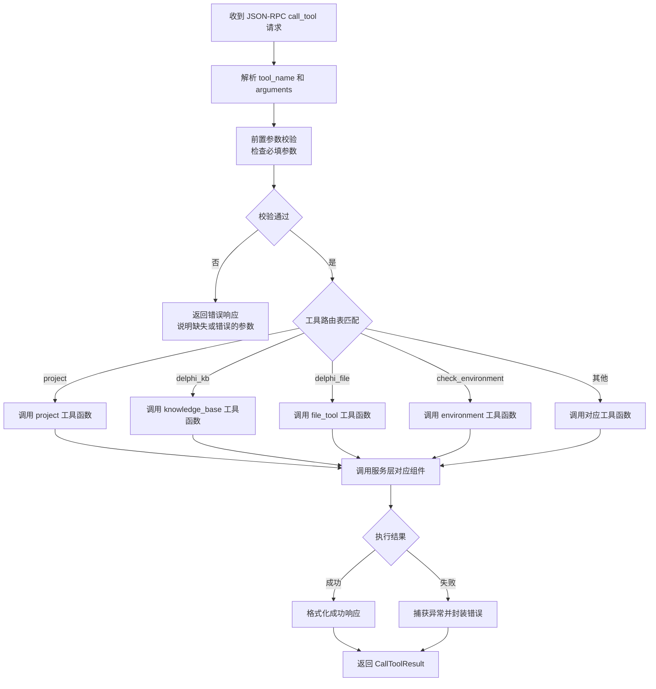

**步骤 1：接收并解析请求**
入口模块 server.py 中的 call_tool 回调函数收到 AI 助手发来的 call_tool 请求，从中提取 tool_name（工具名称字符串）和 arguments（参数字典，键值对形式）。

**步骤 2：前置参数校验**
在调用具体工具函数之前，对参数进行前置校验。检查必需参数是否缺失、参数值是否在允许范围内、参数类型是否符合预期。例如，project 工具的 project_path 参数不能为空，delphi_file 的 action 参数必须为 "read"、"write"、"format"、"backup" 或 "uses" 之一。

**步骤 3：路由到具体工具处理函数**
根据工具名称通过函数路由表匹配对应的处理函数。每个处理函数接收 arguments 字典作为输入，内部根据 action 参数进一步路由到子操作。

**步骤 4：调用服务层执行业务逻辑**
工具函数将校验后的参数传递给对应的服务层组件执行实际业务处理。例如，project 工具的 compile 操作将 CompileRequest 模型传递给 CompilerService，delphi_kb 工具的 search 操作将搜索关键词传递给 KnowledgeBaseService。

**步骤 5：处理结果并返回**
服务层返回的结构化结果经过工具函数格式化后，封装为 MCP 协议的 TextContent 格式。所有异常在工具层使用 try/except 捕获并转为 CallToolResult(isError=True) 格式，确保不会向 MCP 客户端抛出未处理的 Python 异常。

**关键特性**
- 每个工具通过 action 参数支持多个子操作，减少工具总数便于 AI 记忆，同时保持逻辑内聚。
- 参数校验分为前置强校验和后置软校验，前置校验在调用服务层之前拦截明显错误的请求，节省资源。
- 部分工具（如 delphi_file）实现了多读单写锁（RWLock），同一时刻允许多个读取但只允许一个写入，防止并发写入造成文件损坏。

### 4.6 工具类模块（utils/）

**功能概述**

工具类模块提供 12 个通用支持模块（约 2,836 行代码），涵盖 Delphi 环境检测、工程文件解析、单元依赖分析、文件备份、路径校验、日志记录、版本检查和进度追踪等功能。该模块不实现具体业务逻辑，而是为其他模块提供可复用的基础设施工具。输入为其他模块传入的原始数据（文件路径、注册表键名、XML 字符串、源代码文本等），输出为经过解析、校验或转换后的结构化数据。

**核心类与函数**

| 核心组件 | 所属文件 | 职责 |
|----------|----------|------|
| DelphiEnv | delphi_env.py | 封装 Windows 注册表操作，自动扫描 HKEY_LOCAL_MACHINE 下已安装的 Delphi 编译器和 IDE 版本。 |
| DProjParser | dproj_parser.py | 解析 .dproj XML 工程文件，提取源文件列表、搜索路径、条件编译符号、编译事件、输出配置等。 |
| UnitDependencyAnalyzer | unit_dependency_analyzer.py | 分析 Delphi 源文件的 uses 子句，计算单元之间的依赖关系并构建有向依赖图。 |
| FileBackupManager | file_backup.py | 管理源文件的版本化备份，支持创建新备份、列出历史版本、恢复到指定版本和自动清理旧备份。 |
| Updater | updater.py | 通过 git fetch/pull 执行版本更新，比较本地版本号与远程 tag 版本号，报告版本差异。 |
| DelphiVersions | delphi_versions.py | 维护 Delphi 版本号（3.0 至 37.0）与注册表路径、版本名称的映射关系常量表。 |
| PathValidator | path_validator.py | 校验文件或目录路径的合法性、可访问性和安全性，防止路径遍历攻击。 |
| Logger | logger.py | 提供基于 Python logging 模块的分级日志记录（DEBUG/INFO/WARNING/ERROR），支持文件和终端双输出。 |
| ProgressTracker | progress_tracker.py | 提供控制台进度条和百分比显示，用于长时间运行任务的进度跟踪。 |
| Parser | parser.py | 通用文本解析工具，提供正则表达式辅助和字符串处理函数。 |
| Validator | validator.py | 通用数据校验工具，验证编译结果中的输出文件存在性、可执行文件完整性等。 |

**核心流程/工作流（以编译器检测为例）**

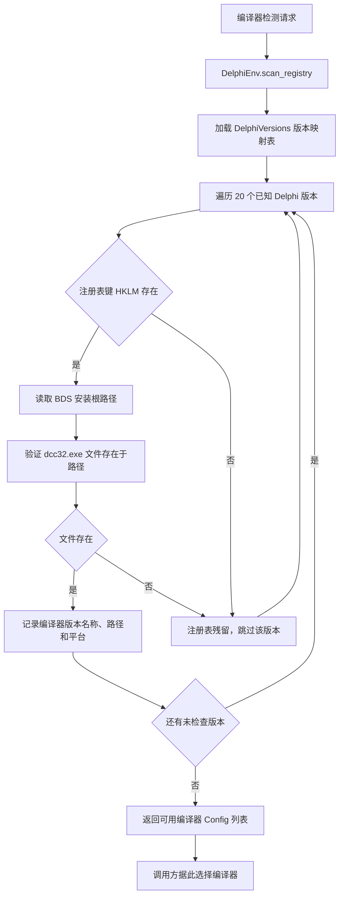

**步骤 1：加载版本映射表并遍历**
DelphiEnv.scan_registry 首先加载 DelphiVersions 模块中定义的版本号映射表，该表包含了从 Delphi 2005（版本 3.0）到最新版（版本 37.0）的注册表路径和名称映射。然后依次检查 HKEY_LOCAL_MACHINE\SOFTWARE\Embarcadero\BDS 下的各个版本键。

**步骤 2：读取注册表并验证路径**
对于每个在注册表中找到的版本键，读取 "RootDir" 值获取 BDS 安装根路径。在该路径的 bin\ 子目录下检查 dcc32.exe（32 位编译器）或 dcc64.exe（64 位编译器）文件是否实际存在。

**步骤 3：路径验证与回退**
如果注册表键存在但编译器文件不存在（例如用户卸载了 Delphi 的某个版本但注册表残留条目未清理），自动跳过该版本。如果注册表读取失败（如权限不足），自动回退到已知的默认安装路径列表（如 C:\Program Files (x86)\Embarcadero\Studio\ 下的各版本目录）。

**步骤 4：组装结果并返回**
所有验证通过的编译器整理为 CompilerConfig 模型列表返回，每个条目包含版本号、版本名称、安装根路径、可执行文件完整路径和支持的编译平台列表。如果未发现任何编译器，返回空列表，调用方据此提示用户安装 Delphi 编译器。

**关键特性**
- 注册表读取失败时自动回退到默认路径列表，提高在不同 Windows 版本和权限设置下的兼容性。
- 路径校验包含路径遍历防护（resolve+abspath 检查），确保用户传入的路径不会超出允许的基目录范围。
- 文件备份管理器支持版本化存储，保留最近 10 个历史版本，防止误写入后无法恢复。
- 日志模块支持按模块名独立配置日志级别，调试时可开启特定模块的 DEBUG 级别日志，线上运行时使用 INFO 级别。

---

## 第五章 安装与配置

### 5.1 系统要求

<!-- ════════════════════════════════════════════════════════════
【生成要求 — 系统要求】

列出软件运行必需的先决条件，用列表形式（每项一行）：

- 操作系统：具体的版本要求
- 编程语言/运行时：版本号
- （可选）第三方依赖：可选安装项，附说明

⚠️ 避免：遗漏关键前提条件
✅ 要求：每项写清楚版本要求
════════════════════════════════════════════════════════════ -->

- **操作系统**：Windows 7 SP1 及以上（Windows 10/11 推荐），支持 x86-64 架构。
- **Python 运行时**：3.10、3.11、3.12、3.13 或 3.14，建议使用 3.12 以获得最佳性能。
- **pip**：21.0 及以上版本，用于安装 Python 依赖包。
- **Git（可选）**：2.30 及以上版本，用于版本更新检查（daofy_update）和代码托管操作（code_hosting）。
- **Delphi 编译器（可选）**：Embarcadero Delphi 2005 至 13 Florence，仅编译功能需要。
- **7-Zip（可选）**：19.00 及以上版本，用于解压 CHM 文档以构建帮助知识库。
- **Edge / Chrome 浏览器（可选）**：最新稳定版，用于软著文档 PDF 渲染。

### 5.2 安装方式

<!-- ════════════════════════════════════════════════════════════
【生成要求 — 安装方式】

提供完整的安装步骤说明（50-150字），包括：
1. 前提条件确认
2. 安装命令或步骤（pip / npm / mvn / 源码编译等）
3. 安装后验证

⚠️ 避免：给出与本项目无关的安装命令
✅ 要求：安装步骤应当真实可操作
════════════════════════════════════════════════════════════ -->

安装可通过 pip 包管理器完成。在确认 Python 3.10+ 环境可用后，执行以下命令：

```bash
pip install daofy-for-delphi
```

国内用户可使用镜像源加速安装：

```bash
pip install daofy-for-delphi -i https://pypi.tuna.tsinghua.edu.cn/simple
```

如需使用文件变更自动监听功能，额外安装可选的 watcher 依赖：

```bash
pip install daofy-for-delphi[watcher]
```

如需语义搜索功能，额外安装 embedding 依赖：

```bash
pip install daofy-for-delphi[embedding]
```

安装完成后，执行 `daofy --version` 验证安装是否成功。也可通过源码方式克隆 GitHub 仓库（`git clone https://github.com/chinawsb/daofy.git`）后执行 `pip install -e ".[dev]"` 进行开发模式安装。

### 5.3 配置方法

<!-- ════════════════════════════════════════════════════════════
【生成要求 — 配置方法】

说明软件的主要配置方式（80-200字）：
1. 配置文件位置和格式（JSON/YAML/TOML 等）
2. 核心配置项及其含义
3. 可选：配置示例

⚠️ 避免：编造不存在的配置文件路径
✅ 要求：配置项描述必须准确
════════════════════════════════════════════════════════════ -->

系统主要依赖运行时自动检测完成配置，极少需要手动修改。核心配置文件为 `config/compilers.json`（JSON 格式），用于存储 Delphi 编译器的路径和版本信息。该文件在首次运行 `check_environment(action="detect")` 时自动生成，通常无需手工编辑。如果需要指定编译器路径，可在 `compilers.json` 中配置如下格式：

```json
{
  "compilers": [
    {
      "version": "11.0",
      "name": "Delphi 11 Alexandria",
      "path": "C:\\Program Files (x86)\\Embarcadero\\Studio\\22.0",
      "dcc32": "bin\\dcc32.exe",
      "platforms": ["win32", "win64"]
    }
  ]
}
```

各知识库的数据库路径在首次构建时自动生成配置文件，存放在 `data/` 目录下各知识库子目录中。当文件路径不在预期的 `src/config/` 下时，系统自动回退到项目根目录的 `config/`，提高不同部署方式下的兼容性。

---

## 第六章 操作说明

### 6.1 操作模式概述

<!-- ════════════════════════════════════════════════════════════
【生成要求 — 操作模式概述】

用一段话说明系统的操作模式（100-150字）：
- 用户通过什么方式与系统交互（GUI/CLI/API 等）
- 系统的工作流程和调用方式

⚠️ 避免：模糊描述
✅ 要求：写清楚交互方式
════════════════════════════════════════════════════════════ -->

用户通过 AI 助手（如 Claude Desktop、CodeArts Agent 等）以自然语言与系统交互。AI 助手收到用户的指令后，根据语义识别意图并调用本系统暴露的 MCP 工具接口。工具调用以 JSON-RPC 协议通过标准输入/输出通道进行，每次调用包含工具名称和参数键值对，系统处理后返回结构化结果。用户无需直接操作命令行或 API，所有复杂操作（编译、搜索、文件读写、Git 操作等）均由 AI 助手根据用户指令自动编排完成。

### 6.2 操作示例

<!-- ════════════════════════════════════════════════════════════
【生成要求 — 操作示例】

必须提供 10 个以上的具体操作示例，覆盖全部 MCP 工具（每个工具至少出现一次）。

每个示例按以下结构展开：

**示例 N：示例标题**
操作描述："用户执行的操作原文或交互场景"

系统响应（版式强制：先用 ```mermaid 流程图展示整体调用链，然后每个步骤单独一段展开说明）：

✅ 格式（先图，再逐段说明）：
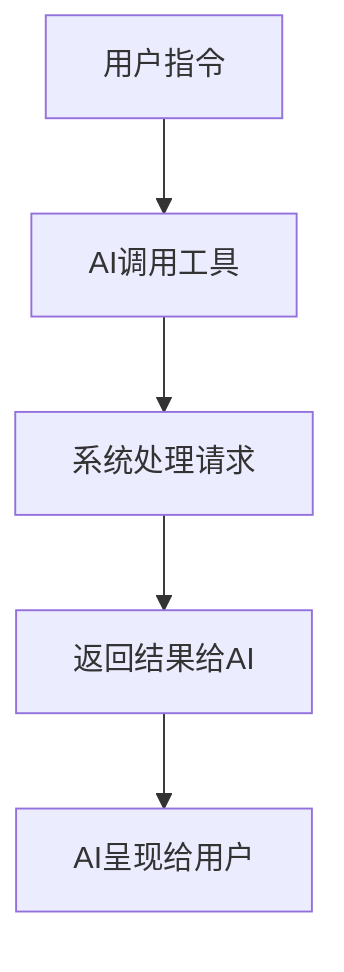

每个步骤展开为独立段落，不要挤在一段，版式强制：
**步骤 1：步骤名称**
详细说明当前步骤的系统行为、工具调用和关键参数。

**步骤 2：步骤名称**
详细说明当前步骤的处理逻辑和中间结果。

**步骤 N：步骤名称**
详细说明最终返回结果和用户侧响应。

建议覆盖的全部工具类型（每个至少一次）：
1. 编译/运行类（project）
2. 搜索/检索类（delphi_kb）
3. 文件操作类（delphi_file）
4. 环境诊断类（check_environment）
5. 组件管理类（manage_component）
6. Git/代码托管类（code_hosting）
7. 经验记忆管理类（experience）
8. 异步/后台任务类（async_task）
9. 包管理类（package）
10. 编码规则查询类（get_coding_rules）
11. 工具帮助类（tool_help）
12. 软著文档生成类（generate_copyright）
13. 版本更新类（daofy_update）
14. 自动化测试类（automate_delphi）

⚠️ 避免：示例只覆盖核心工具，遗漏经验记忆/异步任务/编码规则/包管理/版本更新/自动化等非核心工具
⚠️ 避免：示例过于简单或一步完成
✅ 要求：每个示例包含完整的输入→处理→输出描述，覆盖全部 14 个工具

📸 截图使用规则（重要）：
- 对于涉及 UI 界面变化的示例（如自动化交互、界面操作、弹窗等），必须在步骤中嵌入截图
- ⚠️ 截图格式强制：图片必须独占一行，上下各留一个空行，与文字完全分开
- ✅ 正确的截图排版格式：
  ```
  步骤文字描述段落。

  

  *图片说明文字*
  ```
- 截图文件统一放到 docs/ 下的子目录中，markdown 中路径为相对于说明书 md 文件所在的目录
- 每个截图配一句斜体说明文字，与图片之间空一行
════════════════════════════════════════════════════════════ -->

**示例 1：编译 Delphi 工程（project 工具）**
操作描述："请编译项目目录下的 Project1.dproj，生成 Release 版的 64 位可执行文件。"

系统响应：

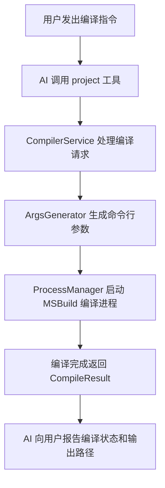

**步骤 1：AI 调用 project 工具**
AI 从用户指令中提取编译目标文件路径、目标平台和构建配置，构造 project 工具的调用参数：action="compile"、project_path="C:\Project\Project1.dproj"、target_platform="win64"、build_configuration="Release"。系统收到请求后，CompilerService 首先检查目标文件是否存在。

**步骤 2：生成编译参数**
ArgsGenerator 模块解析 .dproj 文件，从 XML 结构中提取源文件列表、搜索路径、条件编译符号、输出目录等信息。系统根据工程是否包含编译事件自动选择 MSBuild 引擎（支持事件）或直接调用 dcc64.exe。如果工程定义了 PreBuildEvent，系统会在编译前先执行该脚本并完成 $(PROJECTNAME) 等宏参数的替换。

**步骤 3：执行编译**
ProcessManager 通过 subprocess.Popen 创建编译子进程，传入完整的命令行参数。编译过程中系统每 2 秒检查一次子进程状态，最长等待 30 秒。如果工程定义了 PostBuildEvent，编译成功后自动执行。

**步骤 4：系统返回编译结果**
编译完成后，系统封装 CompileResult 返回给 AI，包含退出码（0 表示成功）、输出文件路径、编译耗时和错误信息列表。AI 将结果呈现给用户：编译成功时报告输出文件的完整路径；编译失败时列出具体错误文件、行号和错误代码。

**示例 2：搜索 Delphi API 定义（delphi_kb 工具）**
操作描述："搜索 TThread 类的 Create 方法的参数和用法。"

系统响应：

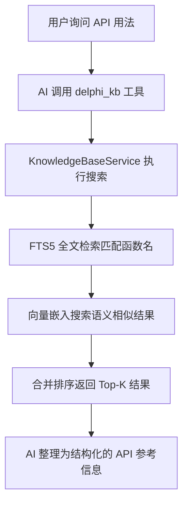

**步骤 1：AI 调用 delphi_kb 工具**
AI 从用户问题中识别出需要搜索 Delphi API 定义，调用 delphi_kb 工具并传入 query="TThread.Create"、search_type="function"、kb_type="delphi"、top_k=5 参数。

**步骤 2：知识库执行双重检索**
KnowledgeBaseService 在 Delphi 源码知识库中执行双重搜索。首先通过 SQLite FTS5 全文索引精确匹配 "TThread.Create" 关键词，返回函数声明和签名。然后计算查询文本的向量嵌入，与知识库中所有函数文档进行余弦相似度计算，返回语义相近的补充结果。

**步骤 3：返回并呈现结果**
系统返回匹配的 API 定义列表，每个条目包含函数声明、参数名称和类型、返回值类型和源代码上下文片段。AI 将结果整理为结构化的 API 参考信息呈现给用户，包括方法签名、参数含义说明和典型使用示例。

**示例 3：读写 Delphi 源文件（delphi_file 工具）**
操作描述："读取 Unit1.pas 文件，在第 20 行后插入一段新的事件处理函数。"

系统响应：

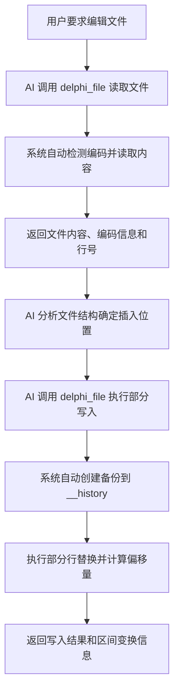

**步骤 1：AI 读取文件内容**
AI 调用 delphi_file(action="read", file_path="src/Unit1.pas") 读取文件。系统通过 BOM 检测和编码猜测库自动识别文件编码（UTF-8、UTF-16 LE 或 GBK），读取文件内容并返回 1-indexed 行号范围和编码类型，同时标记文件是否被截断。

**步骤 2：AI 分析文件并构造写入内容**
AI 分析文件结构，在返回的代码中找到目标插入位置的位置行号。构造写入内容时遵循 Pascal 代码风格和项目命名规范。然后调用 delphi_file(action="write", file_path="src/Unit1.pas", edits=[{"start_line": 20, "end_line": 20, "content": "..."}])。

**步骤 3：系统执行安全写入**
系统在写入前自动创建备份文件到 __history 目录，备份文件名为原文件名加版本后缀（如 Unit1.pas.~1~）。然后执行部分写入，将第 20 行（1-indexed inclusive）替换为新的多行事件处理函数代码。写入完成后返回操作结果，包含原始区间到新区间的变换（如 [20, 20] → [20, 25]）和净偏移量 +5。

**示例 4：诊断编译环境（check_environment 工具）**
操作描述："检查当前的 Delphi 编译环境是否正常，如果缺少编译器请帮助安装 pasfmt。"

系统响应：

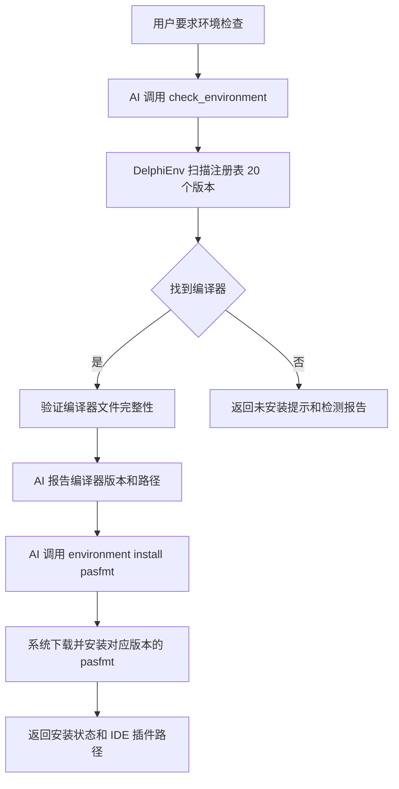

**步骤 1：AI 调用环境检查**
AI 调用 check_environment(action="check")。系统遍历注册表中已知的 20 个 Delphi 版本（2005 至 13 Florence）的安装路径，逐一检查 dcc32.exe 或 dcc64.exe 文件是否存在。

**步骤 2：检查结果处理**
系统返回发现的编译器列表，包含每个编译器的版本号、版本名称、安装路径和可用平台（win32/win64）。AI 将结果呈现给用户。如果未找到任何编译器，系统返回具体的注册表扫描日志，帮助判断是未安装还是路径异常。

**步骤 3：安装 pasfmt 格式化工具**
如果用户要求安装代码格式化工具，AI 调用 check_environment(action="format_install", install_dir="...", delphi_version="11")。系统自动从 GitHub 下载对应 Delphi 版本的 pasfmt RAD Studio 插件包，解压后复制到 IDE 的专家目录（Experts 或 bin 目录），返回安装结果和 IDE 重启提示。

**示例 5：管理 DFM 组件（manage_component 工具）**
操作描述："在 Form1 上添加一个 TButton 按钮，设置 Caption 为 'Hello'，位置在左上角。"

系统响应：

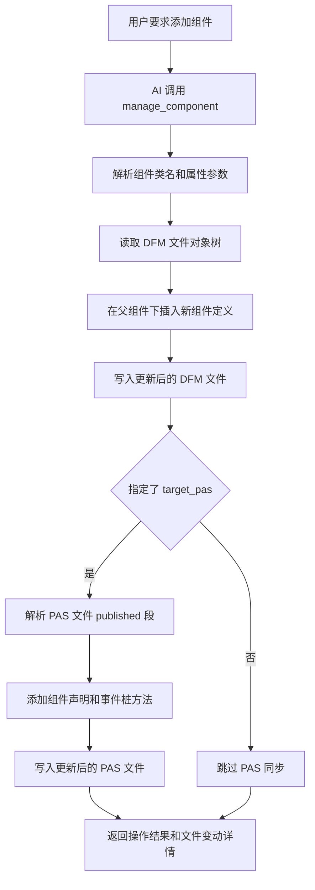

**步骤 1：AI 解析用户指令并调用工具**
AI 从描述中提取组件属性：类名为 TButton，父组件为 Form1，属性 Caption="Hello"、Left=10、Top=10。调用 manage_component(action="add", target_dfm="Unit1.dfm", target_pas="Unit1.pas", component_name="Button1", parent_name="Form1", new_component_class="TButton", properties={"Caption": "Hello", "Left": "10", "Top": "10"})。

**步骤 2：系统更新 DFM 文件**
系统读取 DFM 文件，解析对象树找到 Form1 节点。在 Form1 的子节点列表中按字母顺序插入新的 object Button1: TButton 定义，写入 Caption、Left、Top 等属性的对应值，保持正确的缩进格式。

**步骤 3：同步 PAS 文件声明**
如果指定了 target_pas 文件，系统自动解析 PAS 文件的 published 段，添加 TButton 类型的组件声明（FButton1: TButton）并在适当位置生成空的 OnClick 事件桩方法。

**步骤 4：返回操作结果**
系统返回操作总结，包含 DFM 和 PAS 文件的具体变动内容。AI 将变动呈现给用户确认。

**示例 6：Git 代码托管操作（code_hosting 工具）**
操作描述："查看当前仓库状态，然后提交所有更改并推送到 Gitea 远程仓库。"

系统响应：

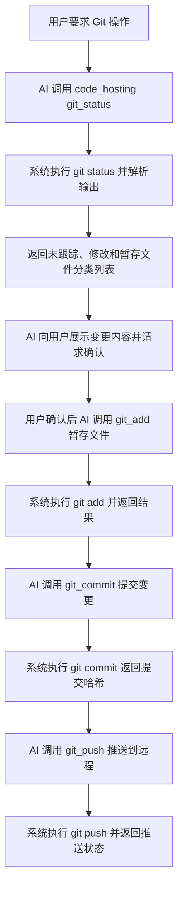

**步骤 1：查看仓库状态**
AI 调用 code_hosting(action="git_status", dir="C:\Project")。系统执行 git status --porcelain 命令，解析输出为结构化数据，返回未跟踪文件、已修改文件和已暂存文件的分类列表，附带每个文件的变更行数统计。

**步骤 2：执行本地提交**
AI 将状态以表格形式呈现给用户。用户确认变更内容后，AI 依次调用 code_hosting(action="git_add", dir="C:\Project", files=["src/Unit1.pas", "src/Unit2.pas"]) 和 code_hosting(action="git_commit", dir="C:\Project", message="添加订单查询功能")。系统执行 git add 和 git commit 操作，返回提交的完整哈希值、作者信息和变更摘要。

**步骤 3：推送到远程仓库**
AI 调用 code_hosting(action="git_push", dir="C:\Project", remote="origin")。系统执行 git push 将本地提交推送到远程仓库。如果推送失败，系统自动进入重试逻辑（git_push_retry），等待 300 秒后重试。推送成功后返回远程仓库的提交地址和推送统计。

**示例 7：经验记忆管理（experience 工具）**
操作描述："请记住刚才解决编译器报错 'F2613 Unit not found' 的方法——需要添加 System.Net.URLClient 到 uses 子句。"

系统响应：

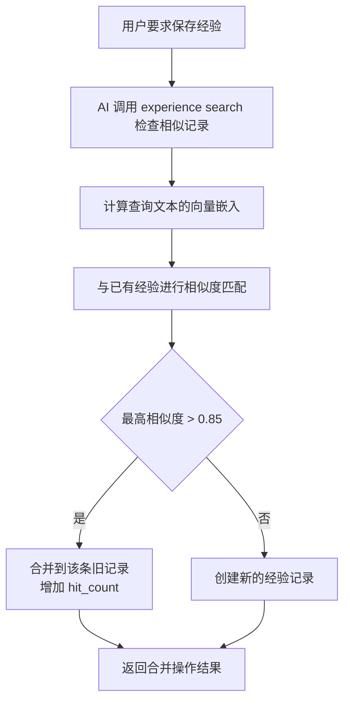

**步骤 1：AI 搜索相似经验**
AI 先调用 experience(action="search", query="添加 System.Net.URLClient 解决 F2613 编译错误")。系统在经验知识库中执行语义搜索，计算查询文本与所有已有经验记录的嵌入向量余弦相似度。

**步骤 2：自动去重决策**
如果搜索结果中存在相似度高于 0.85 的记录（例如已有的"编译单元未找到通用解决方案"），系统返回该条记录及相似度评分，建议合并。AI 决定调用 experience(action="merge", ids=["已知记录ID", "当前场景ID"]) 合并到已有记录。

**步骤 3：保存经验记录**
如果没有相似记录，AI 调用 experience(action="save", problem="F2613 Unit not found 编译器错误", solution="在 uses 子句中添加 System.Net.URLClient 单元", tools_used=["project", "delphi_file"], tags=["编译", "F2613", "网络单元"])。系统返回保存结果，包含经验记录的 ID、创建时间和相似度检查详情。

**示例 8：后台任务管理（async_task 工具）**
操作描述："在后台构建项目知识库，完成后通知我。"

系统响应：

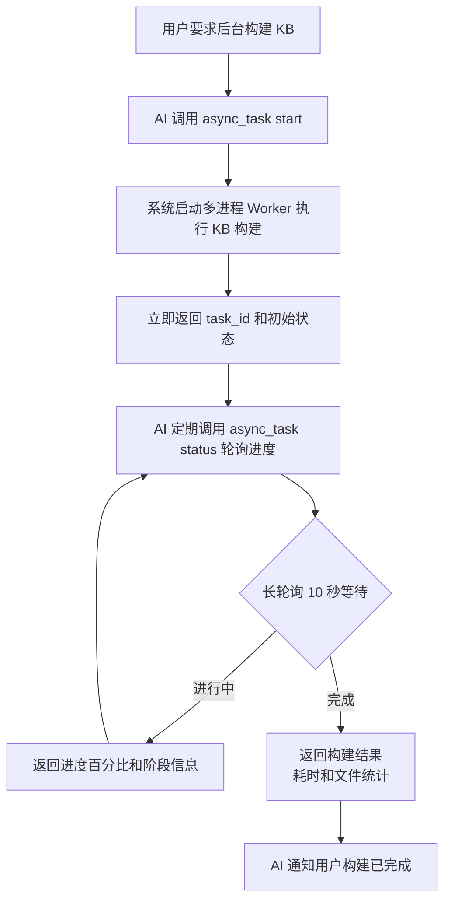

**步骤 1：启动后台任务**
AI 调用 async_task(action="start", task_type="build_knowledge_base", task_params={"rebuild": false, "incremental": true})。系统通过 multiprocessing 启动 Worker 子进程执行知识库构建，不阻塞当前工具调用。立即返回 task_id（如 "task_build_20260608_001"）和初始状态 "running"。

**步骤 2：轮询任务进度**
AI 定期调用 async_task(action="status", task_id="task_build_20260608_001", long_poll_seconds=10)。系统使用最长 30 秒的长轮询等待任务进度更新。返回当前进度，包括已扫描文件数、总文件数、当前处理阶段名称（如 "scanning sources"、"building index"、"generating embeddings"）和预估剩余时间。

**步骤 3：任务完成通知**
当任务完成时，系统返回完整的构建结果，包含构建总耗时、处理的文件数量、提取的类/函数数量、生成的数据库文件大小。AI 向用户报告构建已成功完成。

**示例 9：组件包安装（package 工具）**
操作描述："安装第三方组件包 RzComponents.dpk。"

系统响应：

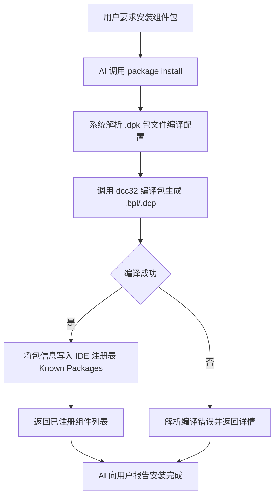

**步骤 1：编译组件包**
AI 调用 package(action="install", package_path="RzComponents.dpk", target_platform="win32", install=true)。系统解析 .dpk 包文件的编译配置，使用 dcc32.exe 编译包文件，生成 .bpl 运行时包文件、.dcp 编译时包文件和 .dpc 资源文件。

**步骤 2：注册到 IDE**
编译成功后，系统将组件包注册信息写入 Windows 注册表（HKEY_CURRENT_USER\Software\Embarcadero\BDS\版本号\Known Packages），使 Delphi IDE 能够识别和加载包中的所有组件。如果指定了 install=false，则仅编译不注册。

**步骤 3：返回安装结果**
系统返回安装状态，包括 .bpl 输出路径、已注册的组件类名列表（从 .dpk 的 contains 子句提取）和编译日志。AI 向用户报告安装成功。

**示例 10：编码规则查询（get_coding_rules 工具）**
操作描述："在修改 Delphi 代码之前，请先获取项目的编码规则。"

系统响应：

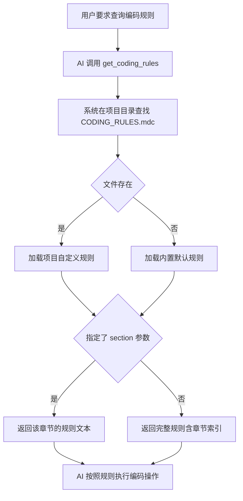

**步骤 1：AI 查询编码规则**
AI 调用 get_coding_rules(project_path="C:\Project")。系统在项目目录下查找 CODING_RULES.mdc 文件。如果存在，加载项目自定义规则（优先级较高）；如果不存在，返回内置默认规则文件的内容。

**步骤 2：按章节获取具体规则**
如果需要特定章节的规则，AI 可指定 section 参数（如 "writing"、"review"、"safety"、"format"、"compile"）。系统只返回对应章节的规则文本，避免一次返回全部内容造成 token 浪费。例如 section="writing" 返回变量命名规范、缩进规则和注释格式要求。

**步骤 3：AI 按照规则执行后续操作**
AI 获取编码规则后，在后续的 delphi_file 写入操作和代码生成过程中严格遵循规则要求，确保生成的代码符合项目约定风格。

**示例 11：工具帮助查询（tool_help 工具）**
操作描述："我不太清楚 project 工具的具体参数，请查看帮助。"

系统响应：

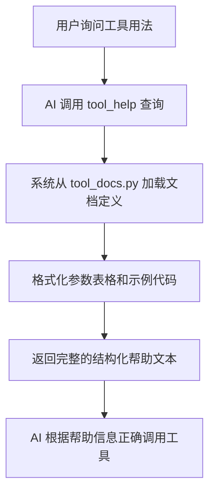

**步骤 1：AI 查询工具帮助**
AI 调用 tool_help(tool_name="project")。系统从配置模块的 tool_help_text 字典中查找 project 工具的完整文档定义。

**步骤 2：格式化帮助内容**
系统将文档格式化为结构化文本，包含工具名称、简要描述、参数字段表格（参数名、类型、是否必填、默认值、说明）以及 JSON 格式的调用示例。不指定 tool_name 时返回所有工具的汇总列表。

**步骤 3：AI 根据帮助操作**
AI 获取帮助后，准确理解 project 工具支持的所有 action 参数（compile、info、create、set、add_config、remove_config、add_source、remove_source、audit、ast、runtime）以及每个 action 对应的必需参数和可选参数，按照正确的格式重新发起工具调用。

**示例 12：软著文档生成（generate_copyright 工具）**
操作描述："生成软件著作权登记所需的全部文档。"

系统响应：

```mermaid
graph TD
    A[用户要求生成软著文档] --> B[AI 调用 generate_copyright validate]
    B --> C[系统检查配置完整性]
    C --> D{配置完整}
    D -->|否| E[返回缺失项提示<br>如缺少著作权人信息]
    D -->|是| F[AI 调用 generate_content 生成草稿]
    F --> G[AI 调用 audit 审计草稿]
    G --> H{草稿存在驳回风险}
    H -->|是| I[AI 根据审计意见修改草稿]
    I --> G
    H -->|否| J[AI 调用 generate 渲染 PDF]
    J --> K[系统通过 Edge 无头模式渲染并输出文件]
    K --> L[返回文档路径和文件信息]
```

**步骤 1：验证配置完整性**
AI 调用 generate_copyright(action="validate")。系统检查软著配置是否完整，包括软件名称、版本号、开发完成日期、著作权人名称、源代码行数等必要信息。如果缺少关键配置项，返回具体的缺失项指示，AI 据此补充配置。

**步骤 2：生成草稿并审计**
配置验证通过后，AI 调用 generate_copyright(action="generate_content") 生成草稿内容。然后调用 generate_copyright(action="audit") 对草稿进行预审计，检查是否有被版权局驳回的风险，如软件名称过长、著作权人与开发完成日期逻辑冲突、文档排版格式异常等。

**步骤 3：渲染 PDF 并输出**
草稿审计通过后，AI 调用 generate_copyright(action="generate", doc_type="all")。系统通过 Edge 或 Chrome 浏览器的无头模式（Playwright/浏览器引擎）将 Markdown 文档渲染为 PDF，包含源代码文档、软件说明书和汇总摘要表三个独立文件，输出到 docs/copyright/ 目录下。

**示例 13：版本更新检查（daofy_update 工具）**
操作描述："检查 Daofy 是否有新版本，如果有请更新。"

系统响应：

```mermaid
graph TD
    A[用户要求版本更新] --> B[AI 调用 daofy_update check]
    B --> C[系统读取本地版本号]
    C --> D[git fetch 获取远程 tag 信息]
    D --> E{比较本地与远程版本}
    E -->|本地已是最新| F[返回无更新信息和版本号]
    E -->|远程有新版本| G[返回版本差异详情<br>版本号/发布说明]
    G --> H[用户确认后 AI 调用 daofy_update update]
    H --> I[git pull 拉取最新代码]
    I --> J[更新完成提示重启服务]
```

**步骤 1：检查版本更新**
AI 调用 daofy_update(action="check")。系统从 __version__.py 文件中读取当前本地版本号（如 "V2026.06.08.1"）。然后执行 git fetch --tags 获取远程仓库的最新 tag 信息，比较本地版本与远程最新版本。

**步骤 2：报告版本差异**
如果本地已是最新版本，系统返回当前版本号和无更新信息。如果检测到新版本，系统返回版本差异详情，包括当前版本、最新版本、发布候选版本列表和更新日志摘要。AI 向用户呈现版本差异，请求用户确认是否更新。

**步骤 3：执行版本更新**
用户确认更新后，AI 调用 daofy_update(action="update")。系统执行 git pull 拉取远程仓库的最新代码。更新完成后返回更新的文件列表、提交哈希和当前部署版本号。AI 建议用户重启 MCP Server 以使更新生效。

**示例 14：Delphi 自动化测试（automate_delphi 工具）**
操作描述："自动测试 Delphi 程序的主窗口，点击 Hello 按钮并验证弹出的消息框。"

系统响应：

```mermaid
graph TD
    A[用户要求自动化测试] --> B[AI 编写 JSON 自动化测试脚本]
    B --> C[AI 调用 automate_delphi 工具]
    C --> D[系统启动目标 exe 进程]
    D --> E[建立命名管道通信连接]
    E --> F[执行 goto 命令定位主窗口]
    F --> G[执行 capture 截图主窗口状态]
    G --> H[执行 click 命令点击 Hello 按钮]
    H --> I[执行 capture 截图按钮点击后界面]
    I --> J{检测到消息框弹窗}
    J -->|是| K[执行 capture 截图消息框]
    K --> L[执行 dlgclick 关闭对话框]
    L --> M[执行 capture 截图最终界面状态]
    J -->|否| N[继续执行后续脚本]
    M --> O[执行 exit 命令退出程序]
    N --> O
    O --> P[返回截图文件路径和执行日志]
```

**步骤 1：AI 编写测试脚本并调用工具**
AI 根据用户描述的测试用例编写 JSON 格式的自动化脚本。脚本包含以下命令序列：goto 定位主窗体、capture 截图、click 点击按钮、再次 capture 截图、msgscan 检测消息框、msgclick 关闭对话框、capture 截图、exit 退出。然后调用 automate_delphi(app_path="C:\TargetApp\TestApp.exe", script="[\"cmd\":\"goto\",\"target\":\"TMainForm\"},...]")。

**步骤 2：系统启动程序并建立连接**
系统启动目标 exe 进程，通过命名管道建立与 Delphi 应用程序的自动化通信连接。连接建立后按 JSON 脚本顺序执行命令。首先执行 goto 命令定位 TMainForm 主窗体，等待窗体完全加载后执行 capture 命令保存主窗口初始状态截图。

系统捕获主窗口的初始界面状态截图：


*自动化测试初始状态：主窗体加载完成后的界面，包含 Hello 按钮和状态标签*

**步骤 3：执行交互操作并捕获结果**
系统执行 click 命令定位到 TButton 组件（Caption="Hello"）并模拟鼠标点击。按钮点击后界面状态发生变化，再次执行 capture 命令保存按钮点击后的状态截图。

系统捕获按钮点击后的界面截图：


*点击 Hello 按钮后标签文本更新为 "Hello, Daofy!"，表明事件响应正确*

**步骤 4：处理消息对话框**
系统执行 msgscan 命令检测是否有消息框弹出。检测到 TMessageForm 类型的对话框后，执行 capture 命令保存消息框截图。

系统捕获消息对话框截图：


*弹出的消息对话框，标题为 "提示"，内容包含确认信息，按钮为 "确定"*

**步骤 5：关闭对话框并验证**
系统执行 dlgclick 命令点击消息框的确定按钮（Button.Caption="确定"）关闭对话框。对话框关闭后执行 capture 命令保存界面状态，确认程序恢复到初始等待状态。

系统捕获对话框关闭后的界面截图：


*消息框已关闭，程序恢复到初始等待用户操作状态*

**步骤 6：退出并返回测试结果**
系统执行 exit 命令，正常退出目标程序并关闭自动化连接。返回完整的执行日志，包含每个命令的执行时间、返回值和截图文件路径列表。AI 将测试结果以截图和时间线形式呈现给用户，验证自动化测试流程全部通过。

---

## 第七章 测试与验收

### 7.1 测试方案

<!-- ════════════════════════════════════════════════════════════
【生成要求 — 测试方案】

说明本软件的测试策略（80-150字）：
1. 使用的测试框架和测试语言
2. 测试范围（单元测试/集成测试/E2E）
3. 测试覆盖情况（39 个测试文件、45 个测试用例）

⚠️ 避免：测试描述与项目实际情况不符
✅ 要求：使用实际扫描得到的数据
════════════════════════════════════════════════════════════ -->

本软件使用 Python 标准测试框架 pytest 进行自动化测试，测试代码全部使用 Python 编写。测试范围包括单元测试和集成测试：单元测试覆盖各个服务层组件（CompilerService、KnowledgeBaseService、FileBackupManager、ArgsGenerator 等）的核心函数，验证输入输出和边界条件；集成测试覆盖工具层到服务层的完整调用链路，验证参数解析、服务调用和结果格式化的协同正确性。全项目共包含 39 个测试文件（45 个测试用例），重点覆盖编译器参数生成、知识库搜索、文件读写备份、组件管理、Git 操作和工具帮助查询等关键功能路径。测试中使用 unittest.mock 打桩隔离外部依赖（文件系统、注册表、子进程、网络请求等），确保测试环境一致性和执行速度。

### 7.2 验收标准

<!-- ════════════════════════════════════════════════════════════
【生成要求 — 验收标准】

必须用表格列出至少 8 项验收标准，格式：
| 编号 | 验收项 | 验收标准 |
|------|--------|----------|

验收项应覆盖各功能模块（至少覆盖 3 个模块，每个模块至少 2 项）

⚠️ 避免：验收标准过于笼统（如"系统运行正常"）
✅ 要求：每项标准必须具体、可验证
════════════════════════════════════════════════════════════ -->

| 编号 | 验收项 | 验收标准 |
|------|--------|----------|
| 1 | 编译器自动检测 | 系统启动时自动扫描注册表，正确识别已安装的 Delphi 版本和编译器路径，未安装时返回空列表。 |
| 2 | 工程编译执行 | 使用 project 工具编译合法的 .dproj 工程，退出码为 0，输出文件存在且为有效 PE 格式。 |
| 3 | 编译错误报告 | 使用 project 工具编译包含语法错误的 .pas 文件，返回的错误信息中包含具体的文件名和行号。 |
| 4 | API 语义搜索 | 使用 delphi_kb 搜索自然语言描述的 Delphi 功能，返回与查询语义相关的 Top-K 条 API 定义。 |
| 5 | 知识库增量更新 | 对已构建的项目知识库新增文件后执行增量更新，新增文件的 API 定义可被搜索查询到。 |
| 6 | 文件安全读写 | 使用 delphi_file 读写 .pas 文件时自动创建 .~1~ 版本备份，误写入后可恢复至前一个版本。 |
| 7 | 编码自动检测 | delphi_file 读取 UTF-8 BOM、UTF-16 LE、GBK 编码的 .pas 文件，均能正确识别编码并返回可读内容。 |
| 8 | DFM 组件同步 | 使用 manage_component 在 DFM 中添加组件后，对应的 PAS 文件中自动生成 published 段组件声明。 |
| 9 | Git 操作执行 | 使用 code_hosting 执行 status/add/commit/push 全流程操作，本地仓库状态与远程仓库同步一致。 |
| 10 | 经验自动去重 | 连续保存两条语义相似度高于 0.85 的经验记录，后者自动合并到前者，数据库中不产生重复记录。 |
| 11 | 后台任务执行 | 使用 async_task 启动知识库构建任务，可查询到实时进度百分比，任务完成后返回正确统计结果。 |
| 12 | 软著文档生成 | 使用 generate_copyright 生成的 PDF 文档包含封面、源代码章节和说明书章节，格式符合版权局提交要求。 |

---
