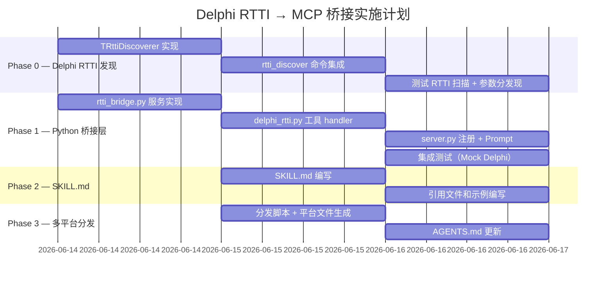

# Delphi RTTI → MCP 桥接设计文档

> **版本**: v0.1 (草案)
> **日期**: 2026-06-13
> **状态**: 设计评审

---

## 目录

1. [背景与问题](#1-背景与问题)
2. [Agent Skills 开放标准概述](#2-agent-skills-开放标准概述)
3. [系统架构](#3-系统架构)
4. [Phase 0 — Delphi 端 RTTI 发现协议](#4-phase-0--delphi-端-rtti-发现协议)
5. [Phase 1 — MCP Tool: delphi_rtti](#5-phase-1--mcp-tool-delphi_rtti)
6. [Phase 2 — Agent Skill: delphi-rtti-bridge](#6-phase-2--agent-skill-delphi-rtti-bridge)
7. [Phase 3 — 多平台 Skill 分发](#7-phase-3--多平台-skill-分发)
8. [类型映射表](#8-类型映射表)
9. [文件清单与实施顺序](#9-文件清单与实施顺序)
10. [参考资源](#10-参考资源)

---

## 1. 背景与问题

### 1.1 现状

Daofy 已经具备通过命名管道与 Delphi 应用通信的自动化引擎 (`automation_service.py`)。其中已包含基于 RTTI 的命令：

| 命令 | 功能 |
|------|------|
| `rcall` | 调用 Delphi 对象的 published 方法 |
| `rinspect` | 检查 Delphi 控件树 |
| `rget` | 读取 Delphi 对象属性 |
| `rset` | 设置 Delphi 对象属性 |

但当前的问题是：**AI 无从知晓 Delphi 应用暴露了哪些能力**。每次调用都需要用户或 AI 猜测方法名和参数格式。

### 1.2 目标

让 Delphi 应用通过 RTTI 自描述其能力，AI Agent 可以：

1. **发现** — 知道 Delphi 应用暴露了哪些 published 方法/属性
2. **调用** — 带类型正确的参数调用这些方法
3. **读取** — 以结构化的方式读取运行时数据
4. **零知识预设** — AI 不需要预知 Delphi 端的 API 设计

### 1.3 设计原则

- **渐进式披露**：只在实际需要时加载完整上下文（遵循 Agent Skills 标准）
- **单点权威**：只维护一份 SKILL.md，其他平台文件自动派生
- **向后兼容**：不破坏现有 `automate_delphi` 工具
- **标准优先**：优先使用 MCP 标准 + Agent Skills 开放标准

---

## 2. Agent Skills 开放标准概述

### 2.1 什么是 Agent Skills

Agent Skills 是 Anthropic 于 2025 年 12 月发布的开放标准（[agentskills.io](https://agentskills.io)），已被 **30+ 工具**采纳：

- Claude Code / Claude.ai
- Cursor / Windsurf
- GitHub Copilot
- OpenAI Codex CLI
- OpenCode / OpenClaw
- Trae Solo
- Gemini CLI
- VS Code (内置)

### 2.2 核心概念：Progressive Disclosure（渐进式披露）

```
Level 1: YAML Frontmatter      —— 始终加载（~50 tokens）
  name + description 告诉 AI 何时触发此技能

Level 2: SKILL.md Body          —— 匹配时加载（~200-500 行）
  完整的步骤指令、规则、示例

Level 3: references/ 文件        —— 按需加载
  scripts/          更深层的文档、脚本、模板
  assets/
```

### 2.3 SKILL.md 文件格式

```markdown
---
name: skill-name
description: 简洁描述技能功能和触发场景（最长 1024 字符）
license: Apache-2.0                    # 可选
compatibility: claude-code, opencode   # 可选
metadata:                              # 可选
  author: daofy
  version: "1.0"
allowed-tools: Bash(*) WebFetch        # 可选，实验性
---

# 技能名称

## 概述
...

## 使用流程
...

## 参考文件
在需要时加载 `references/xxx.md`
```

### 2.4 技能目录结构

```
skill-name/
├── SKILL.md          # 必需：元数据 + 指令
├── scripts/          # 可选：可执行脚本（Python/Bash/JS）
├── references/       # 可选：按需加载的文档
├── assets/           # 可选：模板/资源/配置文件
└── metadata.json     # 可选：额外发现信息
```

---

## 3. 系统架构

### 3.1 整体架构图

```
┌──────────────────────────────────────────────────────────────────┐
│  AI Agent (Claude Code / OpenCode / Cursor / ...)               │
│                                                                  │
│  ┌────────────────────────────┐   ┌──────────────────────────┐  │
│  │ MCP Client                 │   │ Skill Engine              │  │
│  │  ├── list_tools()          │   │  ├── auto-discover        │  │
│  │  ├── call_tool()           │   │  ├── skill("delphi-...") │  │
│  │  └── get_prompt()          │   │  └── progressive load     │  │
│  └──────────┬─────────────────┘   └──────────┬────────────────┘  │
└─────────────┼─────────────────────────────────┼───────────────────┘
              │ MCP stdio                       │ SKILL.md
              ▼                                 ▼
┌──────────────────────────────────────────────────────────────────┐
│  Daofy MCP Server (Python)                                      │
│                                                                  │
│  ┌──────────────────────────────────────────────────────────┐   │
│  │ list_tools()                                              │   │
│  │  ├── delphi_rtti (1 个工具, 3 个 action)                  │   │
│  │  │    ├── action=guide    返回使用指南（自描述）            │   │
│  │  │    ├── action=discover 扫描 Delphi RTTI 能力            │   │
│  │  │    └── action=call     调用 RTTI 暴露的方法             │   │
│  │  └── 其他现有工具（project, delphi_kb, ...）               │   │
│  │                                                           │   │
│  │ list_prompts()                                            │   │
│  │  └── delphi_rtti_guide  完整使用指南（非 OpenCode 兜底）   │   │
│  └──────────────────────────────────────────────────────────┘   │
│                           │                                      │
│                           ▼                                      │
│  ┌──────────────────────────────────────────────────────────┐   │
│  │ rtti_bridge.py                                          │   │
│  │  ├── DelphiRttiBridge(保持长连接)                        │   │
│  │  ├── discover_capabilities(app_path, class_name?)       │   │
│  │  ├── call_method(app_path, class, method, params)       │   │
│  │  └── format_as_mcp_schema(rtti_json) → MCP Tool[]       │   │
│  └──────────────────┬───────────────────────────────────────┘   │
│                     │ 命名管道 \\.\pipe\daofy_auto              │
│                     ▼ JSON 请求/响应                             │
│  ┌──────────────────────────────────────────────────────────┐   │
│  │ Delphi Application                                      │   │
│  │  ┌──────────────────────────────────────────────────┐   │   │
│  │  │ DaofyAutomation Unit                              │   │   │
│  │  │  ├── rcall / rget / rset / rinspect（已有）       │   │   │
│  │  │  └── rtti_discover  ◄── 新增                      │   │   │
│  │  │       └── TRttiDiscoverer                         │   │   │
│  │  │            ├── ScanMethods → JSON Schema           │   │   │
│  │  │            ├── ScanProperties → JSON               │   │   │
│  │  │            └── TypeToSchema(递归)                  │   │   │
│  │  └──────────────────────────────────────────────────┘   │   │
│  └──────────────────────────────────────────────────────────┘   │
└──────────────────────────────────────────────────────────────────┘
```

### 3.2 三层 Token 保护

| 层 | 机制 | 固定消耗 | 触发条件 |
|----|------|---------|---------|
| **L1** | Tool description（`list_tools()`） | ~200 tokens | 每次 MCP 连接 |
| **L2** | Skill frontmatter（name+description） | ~50 tokens | 每次 AI 会话启动 |
| **L3** | SKILL.md body / `action=guide` | ~2-5K tokens | AI 判定需要时按需加载 |

**核心优势**：在 AI 不使用 Delphi RTTI 能力的会话中，固定消耗仅 ~250 tokens（L1+L2）。

### 3.3 跨 Agent 兼容策略

| Agent 类型 | 发现机制 | Skill 加载 | 兜底 |
|-----------|---------|-----------|------|
| Claude Code | `.claude/skills/` 自动发现 | `skill("delphi-rtti-bridge")` | Tool description |
| OpenCode | `.opencode/skills/` 自动发现 | `skill("delphi-rtti-bridge")` | Tool description |
| Cursor | `.cursor/rules/` 自动发现 | @-mention 规则文件 | Tool description |
| Windsurf | `.windsurfrules` | 规则文件 | Tool description |
| Claude Desktop | MCP Prompts `get_prompt()` | Prompt 注入 | Tool description + `action=guide` |
| Trae Solo | Skill 市场安装 | 市场安装 | Tool description |
| Codex CLI | `~/.codex/skills/` 自动发现 | `skill()` | Tool description |
| 其他 MCP 客户端 | 无 | 无 | `action=guide` 返回完整文档 |

---

## 4. Phase 0 — Delphi 端 RTTI 发现协议

### 4.1 新增命令：`rtti_discover`

**请求格式：**

```json
{
  "reqId": "disc_1712345678",
  "cmd": "rtti_discover",
  "target": "TMainForm"
}
```

- `target` 可选，不传时返回所有已注册的 RTTI 类
- `target` 指定时只返回该类的 RTTI 信息

**响应格式：**

```json
{
  "reqId": "disc_1712345678",
  "status": "ok",
  "classes": [
    {
      "className": "TMainForm",
      "ancestor": "TForm",
      "unitName": "Unit1",
      "description": "主窗口",
      "tools": [
        {
          "name": "CreateOrder",
          "description": "创建新订单",
          "parameters": {
            "type": "object",
            "properties": {
              "customerName": {
                "type": "string",
                "description": "客户名称"
              },
              "amount": {
                "type": "number",
                "description": "订单金额",
                "minimum": 0
              },
              "items": {
                "type": "array",
                "items": {
                  "$ref": "#/definitions/OrderItem"
                }
              }
            },
            "required": ["customerName", "amount"]
          }
        }
      ],
      "resources": [
        {
          "name": "order",
          "uri": "delphi://app/order/{id}",
          "mimeType": "application/json",
          "description": "获取订单详情"
        }
      ]
    }
  ],
  "definitions": {
    "OrderItem": {
      "type": "object",
      "properties": {
        "productId": {"type": "integer"},
        "quantity": {"type": "integer", "minimum": 1},
        "price": {"type": "number"}
      }
    }
  }
}
```

### 4.2 TRttiDiscoverer 核心设计

```pascal
unit DaofyAutomation.RttiDiscovery;

interface

uses System.Rtti, System.JSON, System.TypInfo;

type
  TRttiDiscoverer = class
  public
    /// <summary>
    /// 扫描 TClass 的 RTTI，返回 JSON Schema 格式的能力描述
    /// </summary>
    class function DiscoverClass(AClass: TClass; 
      AName: string = ''): TJSONObject;

    /// <summary>
    /// 扫描所有已注册的 RTTI 类
    /// </summary>
    class function DiscoverAllClasses: TJSONArray;

    /// <summary>
    /// 将 Delphi 类型映射为 JSON Schema
    /// </summary>
    class function TypeToSchema(AType: TRttiType): TJSONObject;

    /// <summary>
    /// 检查方法是否需要暴露（可基于自定义属性）
    /// </summary>
    class function ShouldExpose(AMethod: TRttiMethod): Boolean;
  end;

implementation

uses
  System.SysUtils;

class function TRttiDiscoverer.DiscoverClass(AClass: TClass; 
  AName: string): TJSONObject;
var
  Ctx: TRttiContext;
  RType: TRttiType;
  Method: TRttiMethod;
  Param: TRttiParameter;
  Tools: TJSONArray;
  ToolObj: TJSONObject;
  Props: TJSONObject;
  ParamSchema: TJSONObject;
  Required: TJSONArray;
begin
  Result := TJSONObject.Create;
  Ctx := TRttiContext.Create;
  try
    RType := Ctx.GetType(AClass);

    Result.AddPair('className', 
      TJSONString.Create(AName.IsEmpty ? AClass.ClassName : AName));
    Result.AddPair('ancestor', 
      TJSONString.Create(AClass.ClassParent.ClassName));

    // 扫描 published 方法
    Tools := TJSONArray.Create;
    for Method in RType.GetMethods do
    begin
      if not Method.IsPublished then Continue;
      if not ShouldExpose(Method) then Continue;

      ToolObj := TJSONObject.Create;
      ToolObj.AddPair('name', TJSONString.Create(Method.Name));

      // 从自定义属性读取描述
      ToolObj.AddPair('description', 
        TJSONString.Create(GetMethodDescription(Method)));

      // 参数 JSON Schema
      Props := TJSONObject.Create;
      Required := TJSONArray.Create;
      for Param in Method.GetParameters do
      begin
        ParamSchema := TypeToSchema(Param.ParamType);
        ParamSchema.AddPair('description', 
          TJSONString.Create(GetParamDescription(Method, Param)));
        Props.AddPair(Param.Name, ParamSchema);
        if not Param.Flags.HasFlag(ParamFlag.HasDefaultValue) then
          Required.Add(Param.Name);
      end;

      ToolObj.AddPair('parameters', 
        CreateParameterSchema(Props, Required));
      Tools.Add(ToolObj);
    end;
    Result.AddPair('tools', Tools);

    // 扫描 published 属性 → Resources
    // ...（类似逻辑）
  finally
    Ctx.Free;
  end;
end;

class function TRttiDiscoverer.TypeToSchema(AType: TRttiType): TJSONObject;
begin
  Result := TJSONObject.Create;
  case AType.TypeKind of
    tkInteger, tkInt64:
      begin
        Result.AddPair('type', 'integer');
        // 枚举子类型识别：Boolean, Byte, Cardinal, etc.
      end;
    tkFloat:
      if AType.Handle.Name = 'TDateTime' then
      begin
        Result.AddPair('type', 'string');
        Result.AddPair('format', 'date-time');
      end
      else
        Result.AddPair('type', 'number');
    tkString, tkLString, tkWString, tkUString:
      Result.AddPair('type', 'string');
    tkEnumeration:
      begin
        Result.AddPair('type', 'string');
        Result.AddPair('enum', GetEnumValues(AType));
      end;
    tkClass:
      begin
        Result.AddPair('type', 'object');
        Result.AddPair('description', 
          AType.Handle.Name + ' object');
      end;
    tkArray, tkDynArray:
      begin
        Result.AddPair('type', 'array');
        Result.AddPair('items', 
          TypeToSchema(GetArrayElementType(AType)));
      end;
    tkRecord:
      begin
        Result.AddPair('type', 'object');
        // 递归扫描 record 字段
      end;
    // 其他类型...
  end;
end;
```

### 4.3 自定义属性支持（可选增强）

```pascal
type
  /// <summary>
  /// 标记一个 published 方法为 RTTI 可调用，
  /// 可指定显示名和描述
  /// </summary>
  RttiExposeAttribute = class(TCustomAttribute)
  private
    FName: string;
    FDescription: string;
  public
    constructor Create(const ADescription: string); overload;
    constructor Create(const AName, ADescription: string); overload;
    property Name: string read FName;
    property Description: string read FDescription;
  end;

  /// <summary>
  /// 标记参数描述
  /// </summary>
  RttiParamAttribute = class(TCustomAttribute)
  private
    FDescription: string;
  public
    constructor Create(const ADescription: string);
    property Description: string read FDescription;
  end;

// 使用示例
type
  TMyService = class
  published
    [RttiExpose('创建订单')]
    function CreateOrder(
      [RttiParam('客户名称')] CustomerName: string;
      [RttiParam('订单金额')] Amount: Double;
      [RttiParam('订单项列表')] Items: TArray<TOrderItem>
    ): Integer;

    [RttiExpose('GetOrder', '获取订单详情')]
    function GetOrder(OrderId: Integer): TOrder;
  end;
```

### 4.4 安全过滤

`rtti_discover` 支持两种过滤模式：

| 模式 | 机制 | 使用场景 |
|------|------|---------|
| **白名单** | 仅暴露标记了 `RttiExposeAttribute` 的方法 | 生产环境，精确控制暴露面 |
| **黑名单** | 排除标记了 `RttiIgnoreAttribute` 的方法，其余全部暴露 | 开发/调试环境 |

在 `TRttiDiscoverer.ShouldExpose` 中实现：

```pascal
class function TRttiDiscoverer.ShouldExpose(AMethod: TRttiMethod): Boolean;
begin
  // 检查安全配置
  if SecurityMode = smWhitelist then
    Result := HasAttribute(AMethod, 'RttiExposeAttribute')
  else
    Result := not HasAttribute(AMethod, 'RttiIgnoreAttribute');
end;
```

---

## 5. Phase 1 — MCP Tool: delphi_rtti

### 5.1 Tool 定义

在 `server.py` 的 `list_tools()` 中注册一个工具：

```python
Tool(
    name="delphi_rtti",
    description=(
        "Delphi RTTI 桥接 — 通过 RTTI 发现和调用 Delphi 应用程序的运行时能力。\n"
        "三步法：\n"
        "① discover(app_path, class_name?) → 扫描 RTTI 暴露的方法和参数 Schema\n"
        "② call(app_path, class_name, method, params) → 调用方法\n"
        "③ guide → 返回完整使用指南\n"
        "💡 首次使用先 action='guide' 获取完整说明。"
    ),
    inputSchema={
        "type": "object",
        "properties": {
            "action": {
                "type": "string",
                "enum": ["guide", "discover", "call"],
                "description": "操作类型: guide=使用指南, discover=发现能力, call=调用方法"
            },
            "app_path": {
                "type": "string",
                "description": "Delphi exe 文件路径（discover/call 需要，guide 不需要）"
            },
            "class_name": {
                "type": "string",
                "description": "目标类名（discover/call），为空则扫描所有类"
            },
            "method": {
                "type": "string",
                "description": "方法名（call 时需要）"
            },
            "params": {
                "type": "object",
                "description": "方法参数（call 时需要），如 {\"customerName\": \"张三\", \"amount\": 100}"
            },
            "keep_alive": {
                "type": "boolean",
                "default": False,
                "description": "是否保持进程运行供后续复用"
            }
        },
        "required": ["action"]
    }
)
```

### 5.2 新增文件

```
src/
├── services/
│   └── rtti_bridge.py          # RTTI 桥接服务
├── tools/
│   └── delphi_rtti.py          # MCP Tool handler
```

#### `src/services/rtti_bridge.py` 核心设计

```python
"""
Delphi RTTI 桥接服务 — 管理 Delphi 应用的 RTTI 能力发现和调用。

使用已有的 automation_service 命名管道通信，
将 Delphi 端的 RTTI 发现结果转换为 MCP 可用格式。
"""

import json
import time
import logging
from typing import Optional

from src.services.automation_service import (
    _send_command,
    _ensure_process,
    _wait_for_pipe,
    _pool_lock,
    _process_pool,
)

logger = logging.getLogger(__name__)


class RttiDiscoveryResult:
    """单个 Delphi 类的 RTTI 发现结果。"""
    def __init__(self, data: dict):
        self.class_name = data.get("className", "")
        self.ancestor = data.get("ancestor", "")
        self.tools = data.get("tools", [])        # published 方法列表
        self.resources = data.get("resources", []) # published 属性列表
        self.definitions = data.get("definitions", {})

    def to_mcp_tool_list(self, prefix: str = "") -> list:
        """转换为 MCP Tool 列表（供 list_tools 动态注入）。"""
        # 此处可用于 Phase 2 增强
        return []


class RttiBridge:
    """管理一个或多个 Delphi 应用的 RTTI 桥接。

    每个 app_path 对应一个独立的 Delphi 进程和命名管道。
    使用 keep_alive 保持长连接，避免重复启动。
    """

    def __init__(self):
        self._cache: dict[str, dict] = {}  # app_path → discovery result
        self._cache_time: dict[str, float] = {}
        self._cache_ttl: float = 300  # 缓存 5 分钟

    def _is_cache_valid(self, app_path: str) -> bool:
        if app_path not in self._cache:
            return False
        return (time.time() - self._cache_time.get(app_path, 0)) < self._cache_ttl

    def connect(self, app_path: str, keep_alive: bool = True) -> dict:
        """连接 Delphi 应用（启动进程或复用已有）。"""
        from src.services.automation_service import _ensure_process as _ensure
        is_new, err = _ensure(app_path, 10.0)
        if err:
            return {"status": "error", "message": err}
        return {"status": "ok", "reused": not is_new}

    def discover(self, app_path: str, class_name: str = "",
                 force: bool = False) -> dict:
        """发现 Delphi 应用的 RTTI 能力。

        Args:
            app_path: Delphi exe 路径
            class_name: 限定的类名，空串则扫描所有
            force: 强制刷新缓存

        Returns:
            dict: 包含 classes/tools/resources 的 JSON Schema
        """
        # 缓存命中
        if not force and self._is_cache_valid(app_path):
            cached = self._cache[app_path]
            if class_name:
                for cls in cached.get("classes", []):
                    if cls.get("className") == class_name:
                        return {"status": "ok", "class": cls}
                return {"status": "ok", "classes": cached.get("classes", [])}
            return {"status": "ok", **cached}

        # 发送 rtti_discover 命令
        req = {
            "reqId": f"disc_{int(time.time()*1000)}",
            "cmd": "rtti_discover",
            "target": class_name
        }
        resp_raw = _send_command(json.dumps(req, ensure_ascii=False))
        try:
            resp = json.loads(resp_raw)
        except (json.JSONDecodeError, TypeError):
            return {"status": "error", "message": f"无效响应: {resp_raw}"}

        if resp.get("status") != "ok":
            return {"status": "error", "message": resp.get("data", "未知错误")}

        # 更新缓存
        if not class_name:
            self._cache[app_path] = {
                "classes": resp.get("classes", []),
                "definitions": resp.get("definitions", {}),
            }
            self._cache_time[app_path] = time.time()

        return {"status": "ok", **resp}

    def call(self, app_path: str, class_name: str,
             method: str, params: Optional[dict] = None) -> dict:
        """调用 Delphi 应用的 RTTI 暴露方法。

        Args:
            app_path: Delphi exe 路径
            class_name: 类名
            method: 方法名
            params: 参数字典
        """
        req = {
            "reqId": f"call_{int(time.time()*1000)}",
            "cmd": "rcall",
            "target": class_name,
            "method": method,
        }
        if params:
            req["params"] = json.dumps(params, ensure_ascii=False)

        resp_raw = _send_command(json.dumps(req, ensure_ascii=False))
        try:
            resp = json.loads(resp_raw)
        except (json.JSONDecodeError, TypeError):
            return {"status": "error", "message": f"无效响应: {resp_raw}"}

        return {
            "status": resp.get("status", "error"),
            "data": resp.get("data", ""),
            "response": resp,
        }

    def clear_cache(self, app_path: Optional[str] = None):
        """清除缓存。"""
        if app_path:
            self._cache.pop(app_path, None)
            self._cache_time.pop(app_path, None)
        else:
            self._cache.clear()
            self._cache_time.clear()


# 全局单例
_rtti_bridge = RttiBridge()


def get_rtti_bridge() -> RttiBridge:
    return _rtti_bridge
```

#### `src/tools/delphi_rtti.py` 核心设计

```python
"""MCP Tool: delphi_rtti — Delphi RTTI 桥接"""

from src.services.rtti_bridge import get_rtti_bridge

# 完整使用指南（约 2K 字符，按需返回）
RTTI_GUIDE = """\
# Delphi RTTI 桥接 — 使用指南

## 概述
通过 Delphi 的 Enhanced RTTI 发现和调用应用程序的运行时能力。

## 前提
- Delphi 应用已链接 DaofyAutomation 单元
- 应用已编译运行，命名管道已就绪

## 三步工作流

### 第一步：连接并发现
```
delphi_rtti(action="discover", app_path="C:\\App\\MyApp.exe")
```
返回该应用所有类的 published 方法清单，包含：
- 方法名和参数 Schema（JSON Schema 格式）
- 参数类型映射
- 参数是否必需

### 第二步：查看能力详情
discover 返回的 tools 数组中包含每个方法的：
- name: 方法名
- description: 方法说明（如有 RttiExpose 自定义属性）
- parameters: JSON Schema 格式的参数定义

### 第三步：调用方法
```
delphi_rtti(
  action="call",
  app_path="C:\\App\\MyApp.exe",
  class_name="TMainForm",
  method="CreateOrder",
  params={"customerName": "张三", "amount": 100}
)
```

## 类型映射
| Delphi 类型 | JSON 类型 | 说明 |
|------------|----------|------|
| string (UnicodeString, AnsiString, etc.) | string | UTF-8 编码 |
| Integer, SmallInt, Int64, etc. | integer | |
| Single, Double, Currency | number | |
| Boolean, ByteBool | boolean | |
| TDateTime | string | format: date-time |
| TObject / TPersistent | object | 子对象（有限支持） |
| TArray<T> / array of ... | array | 元素类型递归映射 |
| TStrings / TStringList | array of string | |
| 枚举类型 | string | 带 enum 约束 |

## 最佳实践
1. **先 discover 再 call** — 始终先获取能力清单
2. **缓存发现结果** — 同一应用的能力在生命周期内不变
3. **使用 keep_alive** — 多次调用的场景保持进程
4. **参数类型匹配** — 对照类型映射表确保参数类型正确
5. **安全** — 生产环境建议使用 RttiExpose 属性白名单

## 故障排除
- "pipe_unavailable" → 确认 Delphi 应用已启动并链接 DaofyAutomation
- 方法调用失败 → 检查参数名和类型是否与 discover 返回的 Schema 一致
- 空结果 → 确认目标类的方法标记为 published
"""


async def handle_delphi_rtti(arguments: dict) -> dict:
    """处理 delphi_rtti 工具调用。"""
    action = arguments.get("action", "guide")
    bridge = get_rtti_bridge()

    if action == "guide":
        return {
            "content": [{"type": "text", "text": RTTI_GUIDE}],
            "isError": False,
        }

    app_path = arguments.get("app_path", "")
    if not app_path:
        return {
            "content": [{"type": "text", "text": "错误: app_path 是必需的"}],
            "isError": True,
        }

    if action == "discover":
        class_name = arguments.get("class_name", "")
        force = arguments.get("force", False)
        result = bridge.discover(app_path, class_name, force)
        return {
            "content": [{"type": "text", "text": json.dumps(result, ensure_ascii=False, indent=2)}],
            "isError": result.get("status") == "error",
        }

    elif action == "call":
        class_name = arguments.get("class_name", "")
        method = arguments.get("method", "")
        params = arguments.get("params", {})

        if not class_name:
            return {"content": [{"type": "text", "text": "错误: class_name 是必需的"}], "isError": True}
        if not method:
            return {"content": [{"type": "text", "text": "错误: method 是必需的"}], "isError": True}

        result = bridge.call(app_path, class_name, method, params)
        return {
            "content": [{"type": "text", "text": json.dumps(result, ensure_ascii=False, indent=2)}],
            "isError": result.get("status") == "error",
        }

    return {
        "content": [{"type": "text", "text": f"未知 action: {action}"}],
        "isError": True,
    }
```

### 5.3 在 server.py 注册

```python
# imports 新增
from src.tools.delphi_rtti import handle_delphi_rtti

# 在 list_tools() 添加上述 Tool 定义

# 在 call_tool() 分发添加路由
if name == "delphi_rtti":
    result = await handle_delphi_rtti(arguments)
    return CallToolResult(content=[TextContent(text=result["content"][0]["text"])],
                          isError=result["isError"])
```

### 5.4 MCP Prompt 注册（Claude Desktop 兜底）

```python
@server.list_prompts()
async def list_prompts():
    return [
        Prompt(
            name="delphi_rtti_guide",
            description="Delphi RTTI 桥接完整使用指南：类型映射、工作流、最佳实践"
        ),
    ]

@server.get_prompt()
async def get_prompt(name: str, arguments: dict = None):
    if name == "delphi_rtti_guide":
        return GetPromptResult(messages=[
            PromptMessage(
                role="user",
                content=TextContent(type="text", text=RTTI_GUIDE)
            )
        ])
    raise ValueError(f"未知 Prompt: {name}")
```

---

## 6. Phase 2 — Agent Skill: delphi-rtti-bridge

### 6.1 SKILL.md

```markdown
---
name: delphi-rtti-bridge
description: >-
  通过 Delphi RTTI 发现和调用 Delphi 应用程序的运行时能力。
  当你需要读取 Delphi 应用的运行时数据、调用其业务方法、
  或将 Delphi 应用作为 AI 数据源时使用此技能。
  典型场景：通过 Daofy MCP Server 的 delphi_rtti 工具操作 Delphi 应用。
  先使用 delphi_rtti(action='discover') 扫描能力，
  再使用 delphi_rtti(action='call') 调用方法。
license: MIT
compatibility: claude-code, opencode, cursor
metadata:
  author: daofy
  version: "1.0"
  requires: daofy MCP Server (delphi_rtti tool)
---

# Delphi RTTI Bridge

## 概述

通过 Delphi Enhanced RTTI 将 Delphi 应用程序暴露为 AI 可发现和调用的能力源。
此技能配合 Daofy MCP Server 的 `delphi_rtti` 工具使用。

## 使用流程

### 第一步：连接并发现能力

```json
delphi_rtti(action="discover", app_path="C:\\App\\MyApp.exe")
```

返回该应用所有类的 published 方法清单，包含 JSON Schema 格式的参数定义。

### 第二步：理解能力清单

返回的 JSON 结构：

```json
{
  "classes": [
    {
      "className": "TMainForm",
      "ancestor": "TForm",
      "tools": [
        {
          "name": "CreateOrder",
          "description": "创建新订单",
          "parameters": {
            "properties": {
              "customerName": {"type": "string"},
              "amount": {"type": "number", "minimum": 0}
            },
            "required": ["customerName", "amount"]
          }
        }
      ]
    }
  ]
}
```

### 第三步：调用方法

```json
delphi_rtti(
  action="call",
  app_path="C:\\App\\MyApp.exe",
  class_name="TMainForm",
  method="CreateOrder",
  params={
    "customerName": "张三",
    "amount": 100
  }
)
```

## 类型映射

| Delphi 类型 | JSON 类型 | 说明 |
|------------|----------|------|
| string / UnicodeString | string | 默认 UTF-8 |
| Integer / Int64 | integer | 32/64 位有符号整数 |
| Single / Double / Currency | number | 浮点数/货币 |
| Boolean / ByteBool | boolean | |
| TDateTime | string (date-time) | ISO 8601 格式 |
| 枚举 | string (enum) | 带可选值列表 |
| TObject / TPersistent | object | 子对象 |
| 动态数组 / TArray\<T\> | array | 递归映射元素类型 |
| TStrings / TStringList | array of string | |
| Variant | any | 动态类型 |

## 最佳实践

### 先 discover 再 call
始终先 discover 获取完整能力清单，确认方法签名后再调用。

### 缓存发现结果
同一 Delphi 应用进程生命周期内 RTTI 能力不变，discover 一次即可。

### 使用 keep_alive
如需多次调用，在首次 discover 时使用 keep_alive=True 保持进程运行。

### 参数匹配
- 确保参数名与 discover 返回的完全一致（大小写敏感）
- 确保参数类型符合类型映射表
- 必填参数（required 数组中的）不能省略

### 安全
- 开发环境可用黑名单模式，默认排除敏感方法
- 生产环境建议白名单模式，仅暴露标记了 `RttiExpose` 属性的方法

## 故障排除

### "pipe_unavailable"
Delphi 应用未启动或未链接 DaofyAutomation 单元。
确认应用已编译并包含 DaofyAutomation 单元。

### 方法调用失败
检查：
1. 方法名是否与 discover 返回的完全一致
2. 参数名是否匹配
3. 参数类型是否符合映射表
4. 该方法是否为 published

### 空返回
检查目标类的方法是否标记为 `published`。
只有 published 区段的方法才能被 RTTI 发现。

### discover 返回为空
确认：
1. Delphi 应用版本 >= Delphi 2010（支持 Enhanced RTTI）
2. 编译时启用了 `$METHODINFO ON`（默认开启）
3. 类定义中确实有 published 方法

## 参考

完整技术细节见：
- `docs/rtti-mcp-bridge-design.md`
- `src/services/rtti_bridge.py`
- `src/tools/delphi_rtti.py`
```

### 6.2 Skill 文件目录结构

```
.opencode/skills/delphi-rtti-bridge/
├── SKILL.md                    # 核心指令（本文件）
├── references/
│   ├── type-mapping.md         # 详细类型映射参考
│   └── examples.md             # 更多调用示例
└── scripts/
    └── discover_and_call.py    # 可选：辅助脚本
```

---

## 7. Phase 3 — 多平台 Skill 分发

### 7.1 自动分发脚本

创建一个构建脚本 `scripts/build-skills.py`，从权威源 SKILL.md 自动派发到各平台：

```python
"""
技能文件分发脚本 — 从 .opencode/skills/delphi-rtti-bridge/SKILL.md
自动生成各平台所需格式。
"""

import os
import shutil

SKILL_SOURCE = ".opencode/skills/delphi-rtti-bridge/SKILL.md"
PLATFORMS = {
    "claude-code": ".claude/skills/delphi-rtti-bridge/SKILL.md",
    "cursor": ".cursor/rules/delphi-rtti-bridge.mdc",
    "windsurf": ".windsurfrules",
}

def distribute():
    for platform, target in PLATFORMS.items():
        os.makedirs(os.path.dirname(target), exist_ok=True)
        shutil.copy2(SKILL_SOURCE, target)
        print(f"  ✓ {platform} → {target}")

if __name__ == "__main__":
    distribute()
```

### 7.2 各平台路径对照

| 平台 | 路径 | 生效方式 |
|------|------|---------|
| Claude Code | `.claude/skills/delphi-rtti-bridge/SKILL.md` | 自动发现，/delphi-rtti-bridge 或自动触发 |
| OpenCode | `.opencode/skills/delphi-rtti-bridge/SKILL.md` | 自动发现，skill("delphi-rtti-bridge") |
| Cursor | `.cursor/rules/delphi-rtti-bridge.mdc` | @-mention 或自动触发 |
| Windsurf | `.windsurfrules` | 自动读取 |
| Codex CLI | 不放在项目目录，用户自行安装 | ~/.codex/skills/ |
| Trae Solo | 通过市场安装 | 市场搜索安装 |

---

## 8. 类型映射表

### 8.1 基本类型映射

| Delphi 类型种类 | Delphi 类型 | JSON Schema | 示例值 |
|----------------|------------|-------------|--------|
| 字符串 | `string`, `UnicodeString`, `AnsiString`, `WideString` | `{"type": "string"}` | `"你好"` |
| 有符号整数 | `Integer`, `SmallInt`, `ShortInt`, `Int64` | `{"type": "integer"}` | `42` |
| 无符号整数 | `Cardinal`, `Byte`, `Word`, `UInt64` | `{"type": "integer", "minimum": 0}` | `42` |
| 浮点 | `Single`, `Double`, `Extended` | `{"type": "number"}` | `3.14` |
| 货币 | `Currency` | `{"type": "number"}` | `99.99` |
| 布尔 | `Boolean`, `ByteBool`, `WordBool`, `LongBool` | `{"type": "boolean"}` | `true` |
| 日期时间 | `TDateTime` | `{"type": "string", "format": "date-time"}` | `"2026-06-13T10:30:00"` |
| 枚举 | `TAlignment`, `TFormStyle` 等 | `{"type": "string", "enum": ["val1", "val2"]}` | `"taLeftJustify"` |
| 集合 | `TFontStyles` 等 | `{"type": "array", "items": {"type": "string"}}` | `["fsBold", "fsItalic"]` |

### 8.2 复杂类型映射

| Delphi 类型 | JSON Schema | 说明 |
|------------|-------------|------|
| `TArray<Integer>` | `{"type": "array", "items": {"type": "integer"}}` | 泛型数组 |
| `array of string` | `{"type": "array", "items": {"type": "string"}}` | 动态数组 |
| `TStrings` | `{"type": "array", "items": {"type": "string"}}` | 字符串列表 |
| `TList<TObject>` | `{"type": "array", "items": {"type": "object"}}` | 对象列表（有限支持） |
| `record` / 结构体 | `{"type": "object", "properties": {...}}` | 递归扫描字段 |
| `TObject` 子类 | `{"type": "object", "description": "ClassName"}` | 输出完整类型名 |
| `Variant` | `{"type": ["string", "number", "boolean", "null"]}` | 动态类型 |
| `TStream` 子类 | `{"type": "string", "contentEncoding": "base64"}` | 二进制流 |

### 8.3 类型映射优先级

当类型识别存在歧义时，优先使用自定义属性提供的类型信息：

1. `RttiParamAttribute` 或 `RttiExposeAttribute` 中声明的类型
2. Delphi RTTI 类型信息
3. 默认类型推断（如 `Integer → integer`）

---

## 9. 文件清单与实施顺序

### 9.1 完整文件清单

| 文件 | 所属 Phase | 说明 |
|------|-----------|------|
| Delphi: `DaofyAutomation.RttiDiscovery.pas` | Phase 0 | TRttiDiscoverer 实现 |
| Delphi: `DaofyAutomation.pas`（修改） | Phase 0 | 新增 `rtti_discover` 命令路由 |
| Python: `src/services/rtti_bridge.py` | Phase 1 | RttiBridge 桥接服务 |
| Python: `src/tools/delphi_rtti.py` | Phase 1 | MCP Tool handler |
| Python: `src/server.py`（修改） | Phase 1 | 注册工具和 Prompt |
| Python: `src/tool_docs.py`（修改） | Phase 1 | 添加 delphi_rtti 帮助文档 |
| Markdown: `.opencode/skills/delphi-rtti-bridge/SKILL.md` | Phase 2 | 权威 SKILL.md |
| Markdown: `.opencode/skills/delphi-rtti-bridge/references/type-mapping.md` | Phase 2 | 详细类型映射 |
| Markdown: `.opencode/skills/delphi-rtti-bridge/references/examples.md` | Phase 2 | 示例参考 |
| Python: `scripts/build-skills.py` | Phase 3 | 多平台分发脚本 |
| Markdown: `.claude/skills/delphi-rtti-bridge/SKILL.md` | Phase 3 | Claude Code 副本 |
| MDC: `.cursor/rules/delphi-rtti-bridge.mdc` | Phase 3 | Cursor 副本 |
| Markdown: `docs/rtti-mcp-bridge-design.md` | — | 本文档 |

### 9.2 实施顺序



### 9.3 测试策略

| Phase | 测试内容 | 方法 |
|-------|---------|------|
| Phase 0 | RTTI 扫描是否返回正确 JSON Schema | Delphi 端编写测试 Form，调用 `rtti_discover` 验证输出 |
| Phase 0 | 类型映射是否正确 | 覆盖所有 Delphi 基本类型 + 常见复杂类型 |
| Phase 1 | 工具是否能正确分发 action | Python unittest, mock 命名管道响应 |
| Phase 1 | `discover` 缓存逻辑 | 多次调用是否命中缓存、force 参数是否强制刷新 |
| Phase 1 | `call` 参数传递 | JSON 序列化/反序列化是否一致 |
| Phase 2 | Skill 能否被 AI 正确触发 | 实际在 Claude Code / OpenCode 中测试 |
| Phase 3 | 各平台分发是否正确 | 检查各路径文件是否存在 |

---

## 10. 参考资源

### 标准与规范
- **Agent Skills 开放标准**: [agentskills.io](https://agentskills.io)
- **Agent Skills Specification**: [agentskills.io/specification](https://agentskills.io/specification)
- **Anthropic Official Skills**: [github.com/anthropics/skills](https://github.com/anthropics/skills)
- **MCP Specification**: [modelcontextprotocol.io](https://modelcontextprotocol.io)

### 技能市场
- **SkillsMP** (170万+ skills): [skillsmp.com](https://skillsmp.com)
- **Agensi**: [agensi.io](https://agensi.io)
- **SkillsMD**: [skillsmd.dev](https://skillsmd.dev)

### 相关实现
- **Daofy MCP Server**: 本项目
- **mcp-server-delphi** (danieleteti): 另一个使用 RTTI 的 Delphi MCP 实现，但方式不同——它在 Delphi 端实现 MCP Server，而我们用 Python 端做桥接
- **SQLAny_DelphiMCP**: 使用 `MCPToolAttribute` 通过 RTTI 自动发现方法的框架

### 学习资源
- **Anthropic 官方 Skill 构建指南**: [resources.anthropic.com/.../The-Complete-Guide-to-Building-Skill-for-Claude.pdf](https://resources.anthropic.com/hubfs/The-Complete-Guide-to-Building-Skill-for-Claude.pdf)
- **Claude Code 技能文档**: [code.claude.com/docs/en/skills](https://code.claude.com/docs/en/skills)
- **DeepLearning.AI 课程**: Agent Skills with Anthropic (免费)
- **Agent Skills 跨平台移植**: [codex.danielvaughan.com/.../agent-skills-open-standard](https://codex.danielvaughan.com/2026/05/05/agent-skills-open-standard-portable-skills-codex-cli-cross-agent/)
